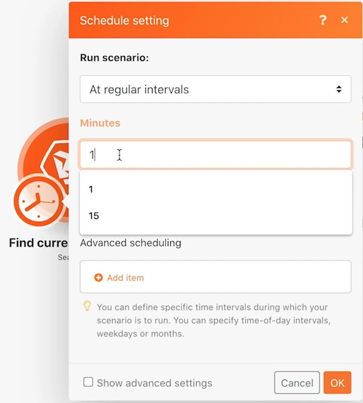
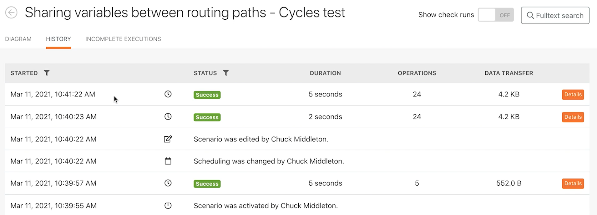

# 探索執行、循環和套件組合

了解使用案例執行歷史記錄的執行、循環和套件組合的行為方式。

## 練習概觀

使用不同藍本設定來探索使用執行和週期。

## 遵循步驟

1. 原地複製名為「在路由路徑之間共用變數」的案例。 將新方案命名為「在路由路徑之間共用變數 — 週期測試」。
1. 移除「傳送電子郵件」模組，因為此測試不需要它。

   **設定您的方案，以處理每次執行的3個週期。 在每個週期中處理5個項目。**

1. 按一下觸發模組，並將「最大」欄位變更為5，因此每個週期中只會處理5個專案。
1. 在「搜尋」條件中，移除將搜尋限制在單一專案的第二個篩選器。
1. 按一下「確定」。

1. 在「融合」工具欄中，開啟「方案」設定，並將「最大週期數」欄位從1更改為3。
1. 按一下「確定」。

   

   **排程藍本以每分鐘執行。**

1. 按一下觸發模組的時鐘圖示，並將「分鐘」欄位變更為1分鐘。

   

1. 接下來，將「執行一次」按鈕下的「排程」切換切換為「開啟」。 儲存您的藍本。

   

1. 轉至方案的「執行歷史記錄」，然後在下一分鐘內看到新歷史記錄。 您可能需要重新整理頁面。

   

1. 按一下運行的「詳細資訊」按鈕。 按一下右側面板中的「簡單」記錄，類似於您在Workfront Fusion訓練的執行歷史記錄部分中所做的操作。
1. 已處理操作的記錄被分為循環。

   

1. 視窗右上角的下拉式功能表可讓您選取每次設定要執行的3個週期中的任何一個。

   
