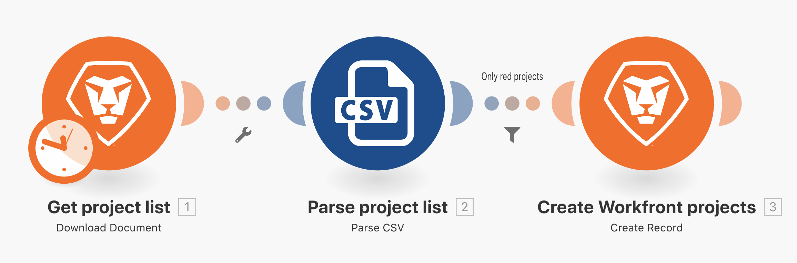

# 篩選器練習

了解如何在模組之間使用篩選器來限定特定類型的套件通過。

## 練習概觀

在「超越基本對應」情境的兩個模組之間新增一個篩選器，限定只可以建立在 CSV 檔案中專案顏色為「紅色」的專案。

## 執行步驟

1. 原地複製「超越基本對應」情境，並將副本命名為「使用功能強大的篩選器」。

   **在「建立 Workfront 專案」模組之前新增一個篩選器，僅允許建立紅色的專案。**

   

1. 按一下連接模組的虛線，或是按一下扳手並選取「設定篩選器」來新增篩選器。
1. 使用「標籤」欄位來命名篩選器為「僅限紅色的專案」。
1. 在「條件」欄位中，對應「專案顏色」欄位 (CSV 檔案中第 3 欄)。 選取「等於 (不區分大小寫)」運算子，然後輸入「red」(紅色)。
1. 按一下「確定」。

   

   **測試篩選器並驗證結果。**

1. 按一下「儲存」來儲存情境並按一下「執行一次」。
1. 按一下篩選器的執行檢查程式，了解篩選器如何檢查每個套件，並且無論通過或不通過均要繼續執行「建立 Workfront 專案」模組。

   

1. 尋找在您的 Workfront 執行個體中建立的專案。
