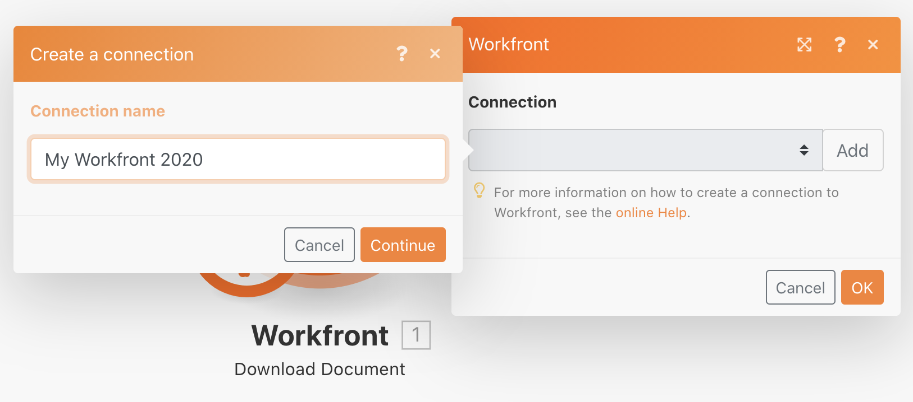
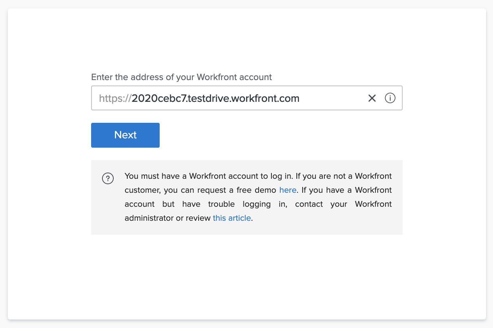
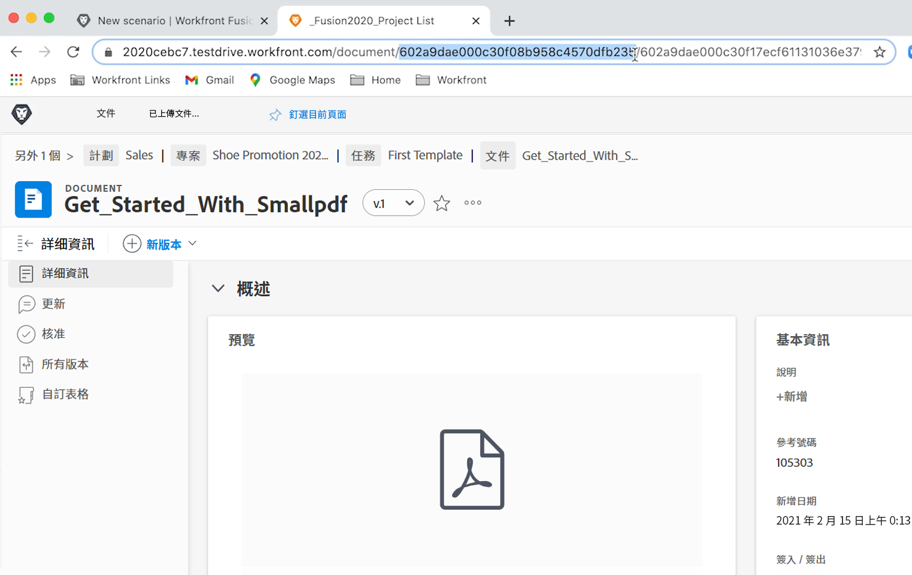

# 初始方案設計

了解初次登入Workfront Fusion時的一些基本導覽秘訣，並建立第一個案例。

## 練習概觀

在Workfront中為專案清單CSV檔案中的每一列建立新專案。

## 遵循步驟

1. 在名為「融合啟用練習」的「案例」區段中建立資料夾。
1. 按一下資料夾，然後按一下「建立新案例」 。

   

1. 在下一頁，搜尋Workfront並選取該應用程式。 然後按一下「繼續」。
1. 在情節設計器畫面的左上角，將您的情況重新命名為「初始設計」
1. 按一下畫面中央的空白觸發器模組，選取Workfront應用程式，然後選取「下載檔案」模組。

   **驗證模組與Workfront帳戶的連線。**

1. 要首次建立連接，請按一下「添加」按鈕。

   

1. 為連線命名，例如「My Workfront 2020」

   

1. 輸入Workfront執行個體的URL，然後按一下「下一步」。

   

1. 輸入您的密碼，然後按一下「登錄」。

   **已建立連接。 現在，輸入您要從Workfront下載之檔案的檔案ID。**

   

1. 回Workfront。 在「Fusion Excerise Files」資料夾中，選擇「_Fusion2020_Project List.csv」，然後按一下左側面板中的「Document Details」（文檔詳細資訊）。 從URL地址複製文檔ID號（這是URL中的第一個長號）。

   

1. 返回「Fusion」（融合），然後將數字貼到「Document ID（文檔ID）」欄位中，然後按一下「OK（確定）」。
1. 最佳實務是在您建立模組時重新命名模組。 以滑鼠右鍵按一下Workfront模組，然後選擇「重新命名」。 將模組命名為「取得專案清單」。

   **接下來，您將剖析剛下載的CSV檔案，以便存取檔案中的每一列。 從每一列建立專案時，您會使用此資訊。**

1. 按一下Workfront模組的右側，以新增其他模組。 搜尋CSV應用程式並選取「剖析CSV模組」。
1. 設定6欄的「剖析CSV」 、 CSV包含標題、逗號分隔字元類型，並將資料放入CSV欄位中。 然後按一下「確定」。

   

1. 將此模組更名為「分析項目清單」。
1. 在方案設計器底部，按一下「保存」以保存您的方案。
1. 按一下「執行一次」以檢視輸出。

   >[!NOTE]
   >
   >忽略變壓器不應是最後一個模組的警告（這是真的，但對於此測試來說無關緊要）。 按一下「仍然執行」 。

   

1. 在剖析CSV模組上開啟執行檢查器，以查看模組的輸入和輸出。 有一個套件組合（CSV檔案）作為輸入，而數個套件組合作為輸出（CSV檔案中每一列各一個套件組合）。 看起來應該像這樣：

   

   **新增模組，以為CSV檔案中的每一列建立專案。**

1. 新增其他模組。 選取Workfront應用程式，選擇「建立記錄」模組。
1. 將記錄類型設定為「項目」。

   >[!TIP]
   >
   >開始輸入幾個字母以搜尋，例如 *proj*，直接進入。

1. 然後，使用Cmd/Ctrl+G查找名稱（項目名稱）。 勾選「名稱」(Name)旁的方塊；欄位會顯示在下方。
1. 現在勾選「計劃開始日期」和「優先順序」旁的方塊。
1. 按一下「名稱」欄位，便會顯示對應面板。 按一下剖析CSV模組中的「欄1」欄位，將其新增至「名稱」欄位。 這是來自CSV檔案的專案名稱。
1. 在「計劃開始日期」中，按一下「剖析CSV模組」中的「欄5」 。
1. 對於「優先順序」，從下拉菜單中選擇「正常」。

   **您的對應面板應如下所示：**

   

1. 按一下「確定」。

   >[!NOTE]
   >
   >如果您未按一下「確定」，並意外按回設計器，則您的工作不會儲存，且您必須再次對應。

1. 以滑鼠右鍵按一下Workfront模組，並將其重新命名為「建立Workfront專案」。
1. 儲存您的藍本，然後按一下「執行一次」按鈕。
1. 按一下最後一個模組右上方的執行檢查器。

   + 您會看到已執行20次操作。 每個操作都從CSV檔案中取得一個套件組合（亦即一列），作為輸入並輸出一個套件組合(在Workfront中建立的專案)。 所建立專案的專案ID會隨輸出套件一起顯示。

   

   **使用附註**

1. 附註有助於讓情境設計更加清晰可見。 若要新增附註至建立Workfront專案模組，請以滑鼠右鍵按一下並選取「新增附註」。 設計器視窗右側的面板會彈出，以便您為模組新增附註。 輸入「以名稱、計劃開始日期和從CSV檔案映射的優先順序建立專案」。
1. 新增其他附註，說明觸發程式模組(第一個Workfront模組)正在執行的動作。
1. 按一下右上角的X以關閉附註面板。

   + 按一下底部工具列中的附註按鈕，或以滑鼠右鍵按一下任何模組並新增附註，即可再次存取附註。
   + 附註會以反向時間順序排序。
   + 新增附註後，「附註」按鈕上會出現橘色圓點。

   

1. 按一下控制項工具列中的「儲存」按鈕，儲存案例。
1. 您可以檢視在Workfront例項中建立的專案。
