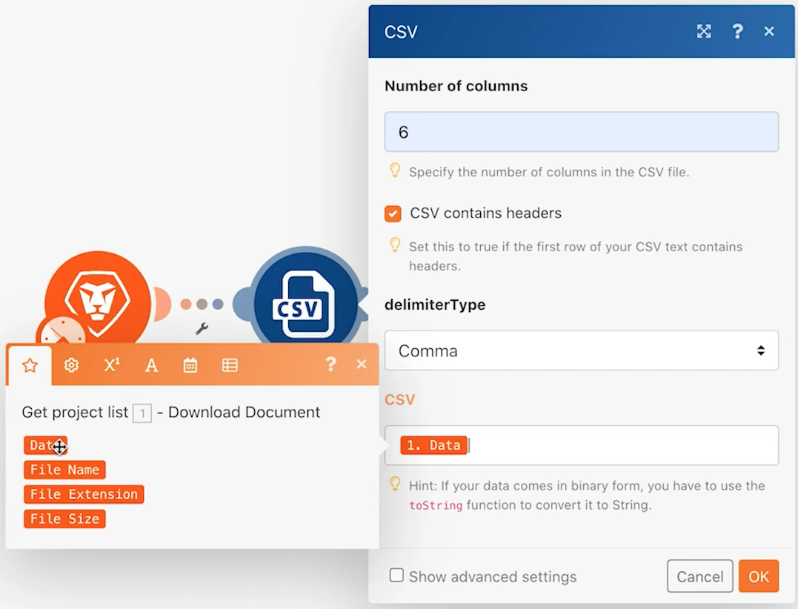

# 初始情境設計練習

了解首次登入 Workfront Fusion 以及建置第一個情境時的基本導覽技巧。

## 先決條件

1. 此練習需要 Workfront 測試操作。填寫[此表單](https://forms.office.com/r/f1J8HRGrNY)即可請求進行測試操作。若您無法存取表單，請把您的姓名、電子郵件地址和公司名稱發送至 wfttstdr@adobe.com。
1. Fusion 練習假設您已經觀看與練習相對應的操作演練影片。在這種情況下，這是[初始情境設計演練](https://experienceleague.adobe.com/docs/workfront-learn/tutorials-workfront/fusion/understand-the-basics/initial-scenario-design-walkthrough.html?lang=zh-Hant)。

## 練習概觀

針對專案清單 CSV 檔案中每一列，在 Workfront 中建立一個新專案。

## 執行步驟

1. 在「情境」區段建立一個資料夾，命名為「Fusion 啟用練習」。
1. 按一下資料夾然後按一下「建立新情境」。

   

1. 在下一頁，搜尋 Workfront 並選取該應用程式。然後按一下「繼續」。
1. 在情境設計工具畫面的左上角，將您的情境重新命名為「初始情境設計」
1. 按一下螢幕中央空白的觸發模組並選取 Workfront 應用程式，然後選取「下載文件」模組。

   **驗證模組與您的 Workfront 帳戶的連線。**

1. 若要首次建立連線，按一下「新增」按鈕。

   

1. 為連線命名，例如「My Workfront 2020」

   

1. 輸入&#x200B;**您的Workfront測試磁碟機帳戶**&#x200B;的URL，然後按[下一步]。

   

1. 輸入您的密碼並按一下「登入」。

   **連線已建立。現在輸入您要從 Workfront 下載的文件之文件 ID。**

   

1. 返回 Workfront。在「Fusion Exercise Files」資料夾中，選取「_Fusion2020_Project List.csv」，然後按一下左側面板中的「文件詳細資料」。複製 URL 地址中的文件 ID 號碼 (這是 URL 中的第一個長數字)。

   

1. 返回 Fusion，將數字貼到「文件 ID」欄位並按一下「確定」。
1. 最佳實務是在建立模組時重新命名。在 Workfront 模組上按一下右鍵並選擇「重新命名」。將模組命名為「取得專案清單」。

   **接下來，您將剖析剛剛下載的 CSV 檔案，以便存取檔案中每一列資料。當您要從每一列建立專案時，將會使用這個資訊。**

1. 按一下 Workfront 模組的右側來新增另一個模組。搜尋 CSV 應用程式並選取「剖析 CSV」模組。
1. 設定對 6 欄執行「剖析 CSV」，選取「CSV 含標題」，對分隔符號類型選擇「逗號」，並在「CSV」欄位中放入「資料」。接著，按一下「確定」。

   

1. 將此模組重新命名為「剖析專案清單」。
1. 在情境設計工具的底部，按一下「儲存」來儲存情境。
1. 按一下「執行一次」來檢視輸出。

   >[!NOTE]
   >
   >請忽略轉換器不應是最後一個模組的警告 (這是事實，但對於此測試並不重要)。按一下「始終執行」。

   

1. 開啟「剖析 CSV」模組上的執行檢查程式以查看模組的輸入和輸出。有一個套件 (CSV 檔案) 作為輸入，並有數個套件作為輸出 (CSV 檔案中每一列有一個套件)。看起來如下所示：

   

   **新增一個模組，為 CSV 檔案中每一列建立一個專案。**

1. 新增另一個模組。選取 Workfront 應用程式，選擇「建立記錄」模組。
1. 將「記錄類型」設為「專案」。

   >[!TIP]
   >
   >開始先輸入幾個字母來搜尋，例如 *proj*，以便直接找到它。

1. 然後使用 Cmd/Ctrl+G 來尋找「名稱」(專案名稱)。勾選「名稱」旁邊的方塊；該欄位出現在下方。
1. 現在勾選「規劃開始日期」和「優先順序」旁邊的方塊。
1. 按一下「名稱」欄位以便顯示對應面板。按一下「剖析 CSV」模組中的「欄 1」欄位，將它新增到「名稱」欄位。這是來自 CSV 檔案的專案名稱。
1. 對於「規劃開始日期」，請按一下「剖析 CSV」模組的「欄 5」。
1. 對於「優先順序」，從下拉式選單選取「正常」。

   **您的對應面板應如下所示：**

   

1. 按一下「確定」。

   >[!NOTE]
   >
   >如果您不按「確定」並不小心點選返回設計工具，則您的工作並未儲存而您必須再次對應。

1. 在 Workfront 模組上按一下右鍵並將其重新命名為「建立 Workfront 專案」。
1. 儲存您的情境並按一下「執行一次」按鈕。
1. 按一下最後一個模組右上方的執行檢查程式。

   + 您將看到已執行 20 次操作。每次操作會使用一個套件，意即從 CSV 檔案擷取一列作為輸入，並輸出一個套件，便是在 Workfront 建立的專案。所建立專案的專案 ID 與輸出套件一起顯示。

   

   **使用備註**

1. 備註能夠提高情境設計的可見度。要將備註新增到「建立 Workfront 專案」模組，請按一下右鍵並選取「新增備註」。設計工具視窗右邊會出現快顯面板，讓您可以新增備註到模組上。輸入「使用對應自 CSV 檔案的名稱、規劃開始日期和優先順序來建立專案」。
1. 新增另一個備註來說明觸發模組 (第一個 Workfront 模) 的作用。
1. 按一下右上角的 X 來關閉備註面板。

   + 按一下工具列底部的備註按鈕，或是在任何模組上按一下右鍵並新增新備註，即可再次存取備註。
   + 備註是按時間倒序排列。
   + 新增備註後，「備註」按鈕上便會出現橘色圓點。

   

1. 按一下控制工具列上的「儲存」按鈕來儲存情境。
1. 您可以檢視自己 Workfront 執行個體中建立的專案。
