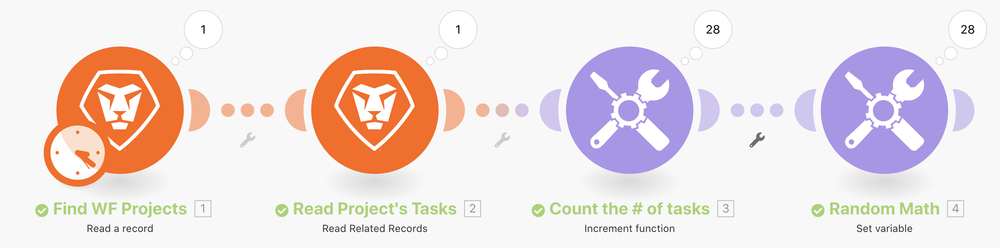
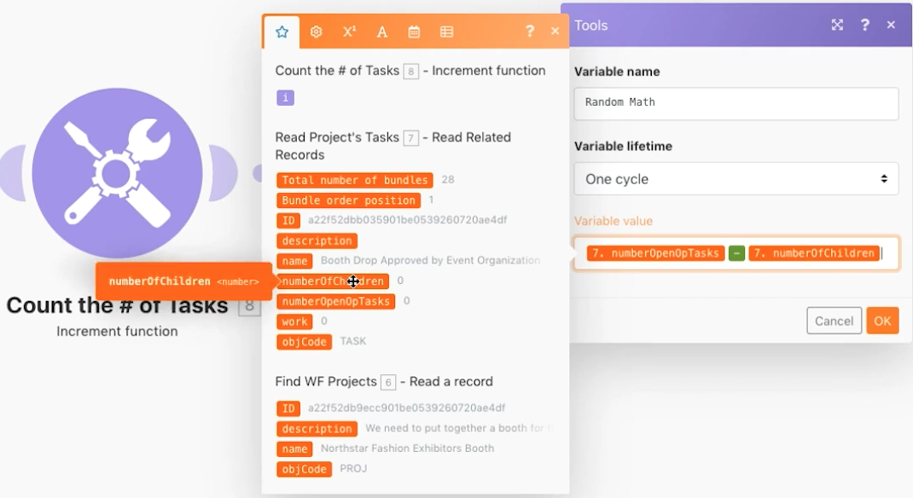

# 疊代器練習簡介

瞭解如何使用疊代類型應用程式和針對每個資訊套件執行動作。

## 練習概觀

查看 Workfront 中的特定專案，然後查看該專案中所有任務。 您將會使用遞增工具模組來計算專案中的任務數量。 最後，您會使用「Set 變數模組」，從「未決問題數量」減去「子系數量」，為每個任務套件產生一個數值。

## 執行步驟

**讀取專案和相關任務。**

1. 開始新的情境。 將其命名為「疊代簡介」。
1. 選取 Workfront 作為觸發模組「讀取一筆記錄」。
1. 對於「記錄類型」，請選擇「專案」。
1. 對於「輸出」，請選擇「ID」、「名稱」和「說明」。
1. 在「ID」欄位中，填入您的 Workfront 產品試用執行個體中「Northstar Fashion Exhibitors Booth」專案的專案 ID。
1. 把這個模組重新命名為「尋找 WF 專案」。
1. 新增另一個 Workfront 模組來讀取與這個專案相關的任務。 選擇「讀取相關記錄」模組。
1. 對於「記錄類型」，請選擇「專案」。
1. 對於父系記錄 ID，請從「讀取一筆記錄」模組選擇 ID。
1. 對於「集合」，選取「任務」。
1. 對於「輸出」，選取「ID」、「名稱」、「說明」、「子系數量」、「未決問題數量」和「工作」。
1. 把這個模組重新命名為「讀取專案的任務」。
1. 儲存情境，然後按一下「執行一次」來查看輸出。

   + 按一下執行檢查程式，您便會看到一個套件作為輸入 (專案) 以及 28 個套件作為輸出 (任務)。

   **計算並處理疊代產生的套件。**

1. 在「讀取相關記錄」之後新增另一個模組。 選擇「遞增函數工具」模組。

   + 保留「重設值欄位」的設定為「從不」再按一下「確定」。

1. 將這個模組重新命名為「計算任務的數量」。
1. 新增「Set 變數」模組。 設定變數名稱為「隨機數學」。
1. 在「變數值」欄位中，從未完成的 opTask 數量中減去未完成子系的數量。

   **應是如下所示：**

   

1. 將這個模組重新命名為「隨機數學」。
1. 請儲存情境並按一下「執行一次」。

針對「讀取相關記錄」疊代器模組所產生的每個任務，Workfront Fusion 已執行 28 次。 這 28 個套件在整個情境中將持續進行處理，除非新增一個彙總計算器來結束迴圈。
