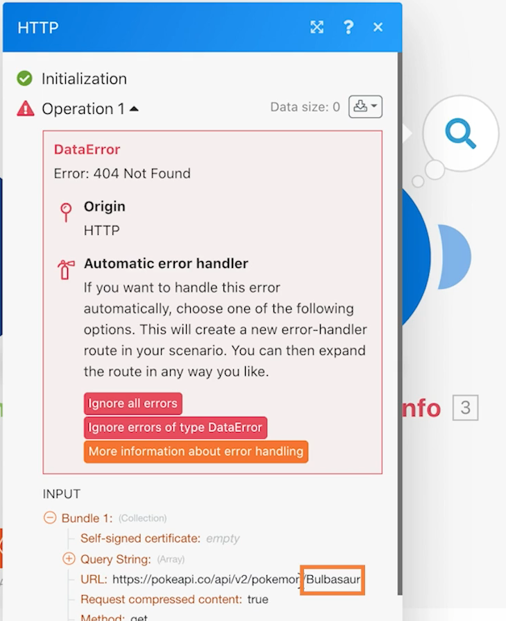

# 通用連接器簡介

讓您更瞭解如何使用 REST 通用連接器和傳回的資料。

## 練習概觀

使用試算表中的寶可夢角色，經由 HTTP 連接器呼叫 Poke API 來收集及張貼關於該角色的更多資訊。

## 執行步驟

**從 Workfront 下載 CSV 檔案。**

1. 在 Workfront「Fusion Exercise Files」資料夾中，選取「_Fusion2020_Shipping Manifest.csv」，然後按一下「文件詳細資料」。
1. 複製 URL 網址中第一個 ID 號碼。
1. 在 Workfront Fusion 中建立新情境。將其命名為「使用通用連接器」。
1. 從 Workfront 應用程式中的「下載文件」模組開始。
1. 設定 Workfront 連線並包含從 Workfront URL 複製而來的文件 ID。
1. 將此模組重新命名為「下載貨運清單」。

   

   **剖析貨運清單資料。**

1. 新增另一個模組，選取「剖析 CSV」。
1. 設定對 11 欄執行「剖析 CSV」。勾選「CSV 包含標題」方塊。「分隔符號類型」請選擇「逗號」，並把取自「下載文件」模組的資料放入「CSV」欄位。

   

1. 將這個模組重新命名為「剖析貨運清單」。
1. 儲存情境並按一下「執行一次」，您便可以在後續步驟看到取自 CSV 檔案的資料。

   **使用通用連接器取得「寶可夢」資料。**

1. 新增「HTTP 提出請求」模組。
1. 在「URL」欄位中使用「`https://pokeapi.co/api/v2/pokemon/[Character]`」，其中「[角色]」對應到「剖析 CSV」模組的第 3 欄。
1. 選取「剖析回應」核取方塊。
1. 選取「顯示進階設定」然後勾選「評估所有狀態是否為錯誤」。
1. 按一下「確定」並重新命名模組為「取得寶可夢資訊」。

   **您的對應面板應如下所示：**

   

   **在這一部分的練習中，您只想處理 CSV 檔案中的第 1 列。**

1. 在「取得寶可夢資訊」模組之前新增篩選器。將其命名為「僅第 1 列」。
1. 設定條件為僅允許 ID 號碼 1 通過。ID 號碼 1 在第 1 列，而「ID」欄位在 CSV 檔案的第 1 欄。

   

1. 儲存情境。
1. 按一下「執行一次」並檢查您在「HTTP 提出請求」模組中收到的錯誤訊息。

   >[!IMPORTANT]
   >
   >請注意，在輸入資料 URL 欄位中，角色名稱均是大寫。這並不適用於 API 呼叫，因為字元名稱必須使用小寫。

   

1. 使用「HTTP 提出請求」的「URL」欄位中的對應面板，使用「**lower**」函數將「[角色]」欄位全部變成小寫字母。

   

   **使用「設定多個變數」模組把 API 的資訊對應回來。**

1. 在「取得寶可夢資訊」之後新增「設定多個變數」模組。對應名稱、身高、體重和能力。
1. 由於「能力」欄位是一個陣列，請記得使用對應函數來存取陣列中每個能力的名稱。

   

   **在不使用篩選器的情況下執行情境以便發現另一個錯誤。**

1. 要處理 CSV 檔案中所有列，請刪除名為「僅第 1 列」的篩選器：

   + 按一下篩選器圖示來編輯。
   + 刪除篩選器標籤。
   + 刪除條件。
   + 按一下「確定」。

1. 請儲存情境並按一下「執行一次」。
1. 「取得寶可夢資訊」模組發生錯誤。您看到一個超級英雄角色傳遞到寶可夢 API。

   >[!NOTE]
   >
   >在路由器操作示範中，您將瞭解如何藉由建立處理超級英雄的另一條路徑來解決此錯誤。

   
