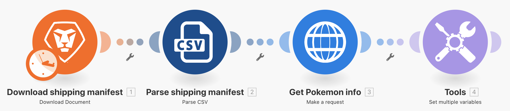

# 通用連接器簡介

擴展您對使用REST通用連接器和使用傳回資料的了解。

## 練習概觀

在試算表中使用Pokemon字元，透過HTTP連接器呼叫Poke API，以收集並發佈該字元的詳細資訊。

## 遵循步驟

**從Workfront下載CSV檔案。**

1. 在Workfront的「Fusion Exercise Files」資料夾中，選擇「_Fusion2020_Shipping Manifest.csv」，然後按一下「Document Details（文檔詳細資訊）」。
1. 從URL位址複製第一個ID號碼。
1. 在Workfront Fusion中建立新案例。 將其命名為「使用通用連接器」。
1. 從Workfront應用程式的下載檔案模組開始。
1. 設定您的Workfront連線，並加入您從Workfront URL複製的檔案ID。
1. 將此模組更名為「下載運送資訊清單」。

   

   **剖析運送資訊清單資料。**

1. 新增其他模組，選取「剖析CSV」。
1. 設定11欄的剖析CSV 。 勾選「CSV包含標題」方塊。 選擇逗號分隔字元類型，並將「資料」從「下載檔案」模組放入CSV欄位中。

   

1. 將此模組重新命名為「剖析運送資訊清單」。
1. 儲存案例並按一下「執行一次」 ，以便在後續步驟中查看CSV檔案中的資料。

   **使用通用連接器取得Pokemon資料。**

1. 新增HTTP Make a Request模組。
1. 在URL欄位中使用 `https://pokeapi.co/api/v2/pokemon/[Character]`，其中 [字元] 會從剖析CSV模組對應至第3欄。
1. 選中「分析響應」複選框。
1. 選取「顯示進階設定」，然後核取「將所有狀態評估為錯誤」旁的方塊。
1. 按一下「確定」，然後重新命名模組「取得Pokemon資訊」。

   **您的對應面板應如下所示：**

   

   **在本練習中，您只想處理CSV檔案中的列1。**

1. 在取得Pokemon資訊模組之前新增篩選器。 將其命名為「僅第1列」。
1. 將條件設為僅允許ID編號1傳遞。 ID編號1在第1行，ID欄位在CSV檔案的第1列。

   

1. 儲存案例。
1. 按一下「執行一次」 ，並觀察您在HTTP Make a request模組中收到的錯誤訊息。

   >[!IMPORTANT]
   >
   >請注意，在輸入資料URL欄位中，字元名稱會加上大寫。 無法用於進行該API呼叫，因為字元名稱必須為小寫。

   

1. 使用HTTP Make a request URL欄位中的對應面板來進行 [字元] 使用 **lower** 函式。

   

   **使用「設定多個變數」模組，將資訊從API對應回。**

1. 在取得Pokemon資訊後新增設定多個變數模組。 地圖名稱、高度、重量和功能。
1. 由於「能力」欄位是陣列，因此請記得使用映射函式訪問陣列中每個能力的名稱。

   

   **在不使用篩選器的情況下執行案例以發現另一個錯誤。**

1. 若要處理CSV檔案中的所有列，請刪除名為「僅第1列」的篩選器：

   + 按一下篩選器圖示加以編輯。
   + 刪除篩選標籤。
   + 刪除條件。
   + 按一下「確定」。

1. 儲存案例，然後按一下執行一次。
1. Get Pokemon資訊模組中發生錯誤。 您會看到超級英雄角色已傳遞至Pokemon API。

   >[!NOTE]
   >
   >在路由器逐步說明中，您將了解如何通過建立單獨的路徑來處理超級英雄來解決此錯誤。

   
