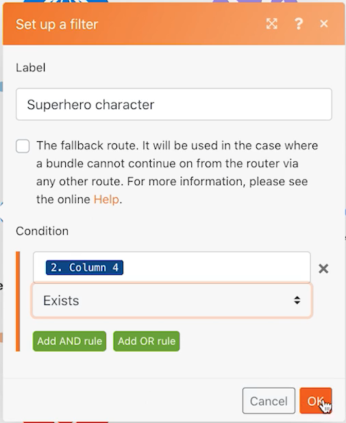

# 路由器

瞭解路由器的重要性，以及如何使用路由器有條件地處理不同的模組。

## 練習概述

使用路由器將「精靈寶可夢」與「超級英雄」組合傳至正確的路徑，然後為每個字元建立任務。

## 要遵循的步驟

1. 複製上一個練習中的使用通用聯結器情境。 將其命名為「使用路由器建立不同的路徑」。

   **複製模組和新增路由器，為超級英雄建立新路徑。**

   

1. 以滑鼠右鍵按一下「取得Pokémon資訊」模組，然後選擇「複製」。 複製後，將其拖曳並連線至新HTTP模組和「剖析CSV」模組之間的線條。

   >[!NOTE]
   >
   > 請注意它如何自動新增具有兩條路徑的路由器。

1. 將此模組命名為「取得超級英雄外觀」。
1. 原地複製此模組，將原地複製移至右側，並將其命名為「取得超級英雄能力」。
1. 複製「工具」模組，並將其移動到第二個路徑的結尾。
1. 按一下工具列中的「棒狀」圖示 — 「自動對齊」按鈕。

   **您的案例應如下所示：**

   

   **接下來，您將會變更新複製模組中的對應值。**

1. 前往 <https://www.superheroapi.com/> 並使用您的Facebook帳戶取得存取Token。

   >[!NOTE]
   >
   >如果您無法存取自己的超級英雄Token，可以使用此共用Token：10110256647253588。 請考慮您呼叫Superhero API的次數，讓此共用Token繼續對每個人都有效。

1. 開啟「取得超級英雄外觀」的設定，並將URL變更為 `https://www.superheroapi.com/api/[access- token]/332/appearance`. 請務必在URL中包含您的存取權杖。 按一下「確定」。
1. 開啟取得超級英雄功能的設定，並將URL變更為 `https://www.superheroapi.com/api/[access- token]/332/powerstats`. 請務必在URL中包含您的存取權杖。 按一下「確定」。
1. 以滑鼠右鍵按一下每個Superhero模組，然後選取「僅執行此模組」。 這會產生您需要檢視以進行對應的資料結構。
1. 執行完這兩者後，請將每個URL欄位中的數字「332」變更為從「剖析CSV」模組對映的「欄4」。

   

   **現在您可以按一下超級英雄路徑中的「設定多個變數」模組，並更新名稱、高度、權重和功能。**

1. 更新取得超級英雄能力模組 — 模組8中的名稱和能力欄位。

   

1. 從「取得超級英雄外觀」模組 — 模組6，更新「高度」和「重量」欄位。

   

   **完成後，變數應如下所示。 請注意，模組編號會顯示在欄位值中。**

   

1. 按一下「確定」，然後儲存您的案例。

   **建立其他路徑，依每個字元建立任務。**

1. 在Workfront中建立空白專案。 將其命名為「出貨資訊清單專案」，並從URL複製專案ID。
1. 返回Workfront Fusion並按一下路由器中央以建立其他路徑。

   

1. 在出現的空白模組中央按一下，並從Workfront應用程式新增建立記錄模組。
1. 將「記錄型別」設定為「任務」，然後從「要對應的欄位」區段中選取「專案ID」。
1. 將您從Workfront複製的專案ID貼到「專案ID」欄位。
1. 現在，從「要對應的欄位」區段中選取「名稱」欄位。
1. 將任務命名為&quot;[字元] 從 [特許經營]，」取得CSV檔案中的字元名稱和授權名稱。 欄3是字元名稱，欄2是特許經營的名稱。

   

1. 按一下「確定」，然後將此模組重新命名為「為每個字元建立任務」。

   **新增篩選器，讓情境可以順利執行，而不會發生錯誤。 您只想讓「精靈寶可夢」字元往上走，只想讓超級英雄字元往下走，讓所有字元往下走。**

1. 按一下「取得Pokémon資訊」模組左側的虛線，以建立第一個篩選器。 將其命名為「神奇寶貝字元」。
1. 針對條件，僅允許特許經營（第2欄）等於「神奇寶貝兒」的記錄。 選擇文字「等於」運運算元。
1. 按一下「取得超級英雄外觀」模組左側的虛線，以建立下一個篩選器。 將其命名為「Superhero character」。
1. 由於超級英雄可能來自各種特許經營權，因此請使用Superhero ID欄位（欄4）來判斷某個字元是否為超級英雄。

   **您的篩選器應如下所示：**

   

   

1. 儲存情境並按一下「執行一次」。 使用執行檢查器來確認所有操作都成功，並檢查在您的Workfront專案中建立的任務。

   
