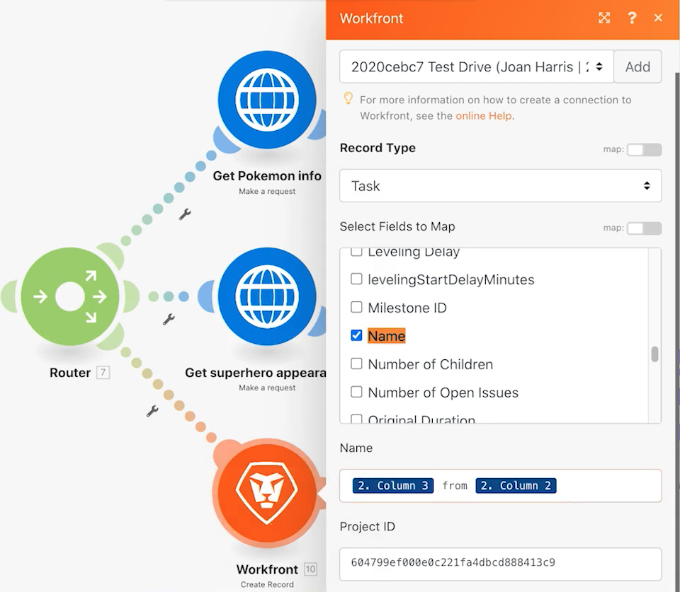

# 路由器

了解路由器的重要性，以及如何使用路由器有條件地處理不同的模組。

## 練習概觀

使用路由器將Pokemon與超級英雄捆綁在正確的路徑上，然後為每個字元建立任務。

## 遵循步驟

1. 從先前練習中原地複製使用通用連接器案例。 將其命名為「使用路由器建立不同路徑」。

   **通過克隆模組和添加路由器為超級英雄建立新路徑。**

   

1. 按一下右鍵「Get Pokemon info module（獲取Pokemon資訊模組）」 ，然後選擇「Clone（克隆）」。 複製後，將其拖曳並連線至新HTTP模組和剖析CSV模組之間的行。

   >[!NOTE]
   >
   > 注意它如何自動添加包含兩條路徑的路由器。

1. 將此模組命名為「獲取超級英雄外觀」。
1. 克隆此模組，將克隆移到右側，並將其命名為「獲取超級英雄能力」。
1. 複製工具模組並將其移至第二個路徑的結尾。
1. 按一下工具列中的棒表徵圖 — 自動對齊按鈕。

   **您的案例應如下所示：**

   

   **接下來，您將變更新複製模組中的對應值。**

1. 前往 <https://www.superheroapi.com/> 並使用您的Facebook帳戶取得存取權杖。

   >[!NOTE]
   >
   >如果您無法存取自己的超級英雄代號，可以使用此共用代號：10110256647253588。 請考慮您呼叫超級英雄API的次數，讓此共用代號可持續適用於所有人。

1. 開啟「取得超級英雄外觀」的設定，並將URL變更為 `https://www.superheroapi.com/api/[access- token]/332/appearance`. 請務必在URL中加入存取權杖。 按一下「確定」。
1. 開啟「獲取超級英雄」功能的設定，並將URL更改為 `https://www.superheroapi.com/api/[access- token]/332/powerstats`. 請務必在URL中加入存取權杖。 按一下「確定」。
1. 按一下右鍵每個超級英雄模組，然後選擇「僅運行此模組」。 這會產生您需要查看的對應資料結構。
1. 執行兩者後，將每個URL欄位中的數字&quot;332&quot;變更為從剖析CSV模組映射的欄4。

   

   **現在，您可以按一下超級英雄路徑中的「設定多個變數」模組，並更新名稱、高度、重量和功能。**

1. 更新獲取超級英雄能力模組 — 模組8中的「名稱」和「能力」欄位。

   

1. 從「獲取超級英雄外觀模組 — 模組6」更新「高度」和「權重」欄位。

   

   **完成後，變數應該會如下所示。 請注意，模組編號會出現在欄位值中。**

   

1. 按一下「確定」，然後儲存您的藍本。

   **建立其他路徑以按字元建立任務。**

1. 在Workfront中建立空白專案。 將其命名為「運送資訊清單專案」，然後從URL複製專案ID。
1. 返回Workfront Fusion，然後按一下路由器中心以建立其他路徑。

   

1. 按一下顯示之空白模組的中央，然後從Workfront應用程式新增建立記錄模組。
1. 將「記錄類型」設定為「任務」，並從「要映射的欄位」部分選擇「項目ID」。
1. 將您從Workfront複製的專案ID貼到「專案ID」欄位。
1. 現在，從「要映射的欄位」區段中選取「名稱」欄位。
1. 將任務命名為[字元] 從 [特許經營]，」會從CSV檔案取用字元名稱和特許經營權名稱。 第3欄是字元名稱，第2欄是特許經營權的名稱。

   

1. 按一下「確定」，然後將此模組更名為「為每個字元建立任務」。

   **新增篩選器，以便執行案例而不會發生錯誤。 你只希望Pokemon字元沿著最上方的路走，只希望超級英雄字元沿著中間的路走，希望所有字元沿著最下方的路走。**

1. 按一下「取得Pokemon資訊」模組左側的虛線，以建立第一個篩選器。 將其命名為「Pokemon字元」。
1. 對於條件，僅允許特許經營權（第2欄）等於「Pokemon」的記錄。 選擇「等於」運算子。
1. 按一下取得超級英雄外觀模組左側的虛線，以建立下一個篩選器。 命名為超級英雄人物。
1. 因為超級英雄可能來自各種特許經營，所以使用超級英雄ID欄位（第4欄）來判斷角色是否為超級英雄。

   **您的篩選器應如下所示：**

   

   

1. 儲存案例，然後按一下執行一次。 使用執行檢查員來驗證所有操作是否成功，並檢查在您的Workfront項目中建立的任務。

   
