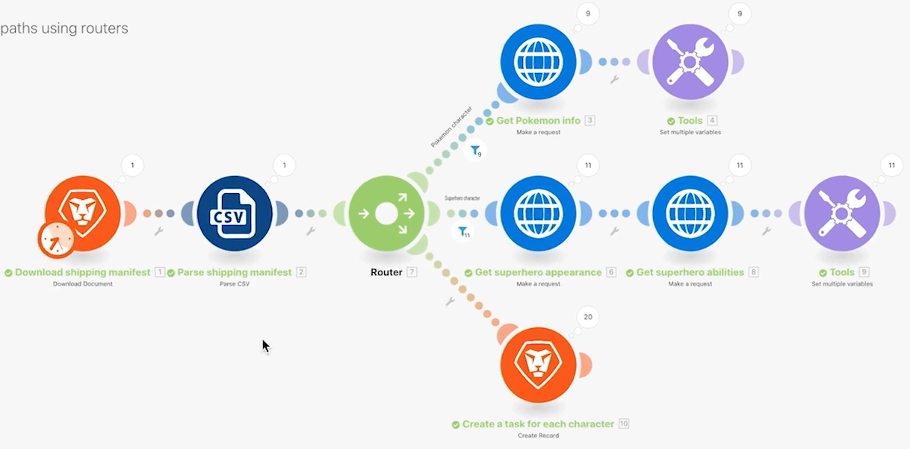

# 路由器

瞭解路由器的重要性以及如何使用路由器按照條件處理不同的模組。

## 練習概觀

使用路由器將寶可夢與超級英雄套件依正確路徑傳遞，並為每個角色建立一項任務。

## 執行步驟

1. 原地複製上一個練習的「使用通用連接器」情境。將其命名為「使用路由器建立不同路徑」。

   **原地複製模組並新增路由器，即可為超級英雄建立新路徑。**

   

1. 在「取得寶可夢資訊」模組按一下右鍵，然後選擇「原地複製」。原地複製完成後，拖曳模組並連接到新 HTTP 模組與剖析 CSV 模組之間的線條。

   >[!NOTE]
   >
   > 請注意模組如何自動新增擁有兩條路徑的路由器。

1. 將此模組命名為「取得超級英雄外型」。
1. 原地複製這個模組，把複製出來的副本向右移動，然後命名為「取得超級英雄能力」。
1. 原地複製工具模組並把模組移動到第二條路徑的尾端。
1. 按一下工具列的魔杖圖示，即自動對齊按鈕。

   **您的情境應該如下所示：**

   

   **接下來，您將要變更原地複製的新模組中的對應值。**

1. 前往 <https://www.superheroapi.com/> 並使用您的 Facebook 帳戶取得存取語彙基元。

   >[!NOTE]
   >
   >若您無法存取自己的超級英雄語彙基元，您可以使用這個共用語彙基元：10110256647253588。關於呼叫超級英雄 API 的次數，請多考慮他人的權益，讓這個共用的語彙基元可以供所有人使用。

1. 開啟「取得超級英雄外型」的設定並把 URL 變更為 `https://www.superheroapi.com/api/[access- token]/332/appearance`。請務必在 URL 中包含您的存取語彙基元。按一下「確定」。
1. 開啟「取得超級英雄能力」的設定並把 URL 變更為 `https://www.superheroapi.com/api/[access- token]/332/powerstats`。請務必在 URL 中包含您的存取語彙基元。按一下「確定」。
1. 在每個超級英雄模組上按一下右鍵並選取「僅執行這個模組」。這樣會產生您在對應時需要查看的資料結構。
1. 執行兩者後，將每個 URL 欄位中的數字「332」變更為從剖析 CSV 模組對應而來的第 4 欄。

   

   **現在，您可以按一下超級英雄路徑中的設定多個變數模組，並更新名稱、身高、體重和能力。**

1. 更新取自「取得超級英雄能力」模組 (模組 8) 的「名稱」和「能力」欄位。

   

1. 更新取自「取得超級英雄外型」模組 (模組 6) 的「身高」和「體重」欄位。

   

   **完成後，您的變數應如下所示。請注意，模組編號顯示在欄位值。**

   

1. 按一下「確定」然後儲存您的情境。

   **建立另一條路徑，為每個角色建立一項任務。**

1. 在 Workfront 中，建立一個空白專案。將其命名為「貨運清單專案」並從 URL 複製專案 ID。
1. 返回 Workfront Fusion 並按一下路由器的中心來建立另一條路徑。

   

1. 在出現的空白模組中心按一下，然後新增取自 Workfront 應用程式的「建立記錄模組」。
1. 「記錄類型」設為「任務」並從「對應欄位」區段選取「專案 ID」。
1. 把從 Workfront 複製的專案 ID 貼到「專案 ID」欄位。
1. 現在從「對應欄位」區段選取「名稱」欄位。
1. 把任務命名為「來自[電影系列]的[角色]」，從 CSV 檔案擷取角色名稱和電影系列名稱。第 3 欄是角色名稱，而第 2 欄是電影系列名稱。

   

1. 按一下「確定」，將這個模組重新命名為「為每個角色建立一項任務」。

   **新增篩選器，讓情境可以順利執行無錯誤。您想要只有寶可夢的角色通過上層路徑，只有超級英雄的角色通過中間路徑，以及所有角色通過下層路徑。**

1. 按一下「取得寶可夢資訊」模組左邊的虛線來建立第一個篩選器。將其命名為「寶可夢角色」。
1. 而條件是僅允許電影系列 (第 2 欄) 等於「寶可夢」的記錄。選擇文字「等於」運算子。
1. 按一下「取得超級英雄外型」模組左邊的虛線來建立下一個篩選器。將其命名為「超級英雄角色」。
1. 因為超級英雄可能來自不同的電影系列，使用「超級英雄 ID」欄位 (第 4 欄) 來判定一個角色是否屬於超級英雄。

   **您的篩選器應如下所示：**

   

   

1. 請儲存情境並按一下「執行一次」。使用執行檢查程式確認所有操作均成功，並檢查在 Workfront 專案中建立的任務。

   
