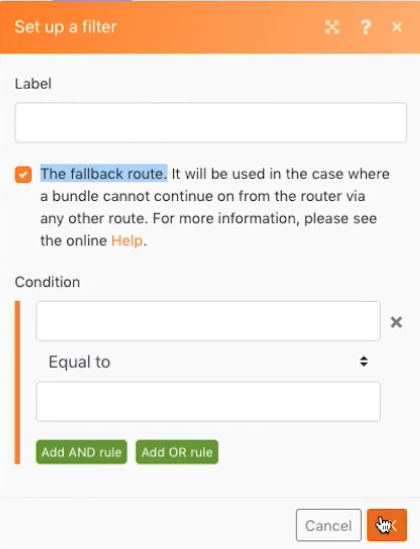

# 路由模式

強化路由和備援路由的概念，而不需實際處理任何其他API。

## 練習概觀

使用「設定變數」模組，透過多個路徑傳送數字，以查看篩選器和回傳在路由時的行為。

## 遵循步驟

1. 建立新情境，並將其稱為「路由模式和回退」。
1. 針對觸發器，新增「設定變數」工具模組。 將「My Number」（我的數字）放入變數名稱，將「變數」存留期保留為「一個」週期，並將「變數」欄位設為「75」。

   

1. 添加另一個模組並選擇路由器模組。 對於兩個路徑，選擇「增量」函式工具，然後按一下「確定」，不對每個路徑進行任何更改。

   + 對於第一個路徑，建立篩選器，將其命名為「小於100」，並將條件設為 [我的數字] 少於100。

   + 對於第二個路徑，請建立篩選器，將其命名為「小於1000」，然後將條件設為 [我的數字] 少於1000。 請務必同時使用數值運算子。

   

   

1. 按一下「執行一次」 ，並觀看套件組合向下傳遞「小於100」路徑。
1. 然後將「設定變數」模組欄位變更為950，並再次執行。 看著它沿著第二條路跑。
1. 按一下路由器並添加一條路徑。 添加增量函式工具模組。 對於篩選器，按一下「備援路由」核取方塊。 請注意，指向該路徑的箭頭會如何變更為脫字元號，指出這是後援路由。

   

1. 將「設定變數編號」變更為9500，然後執行一次。 由於數字不小於100或小於1000，因此捆綁包將沿後退路由傳送。

如果您使用增量函式工具模組新增一個路徑，但未設定篩選器，當您再次按一下「執行」時會發生什麼事？ 捆綁包是否會隨著添加的第四條路由沿著後援路由前進？

+ 否，因為沒有設定任何篩選器，所有套件一律會沿此路徑前進，而非後援路由。
