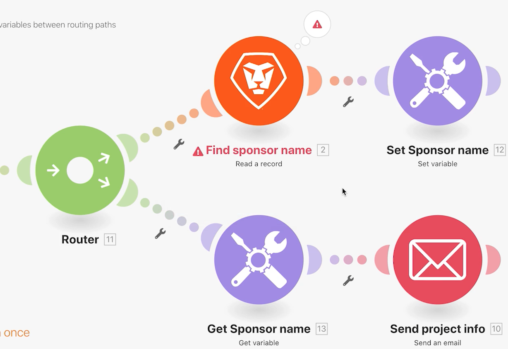
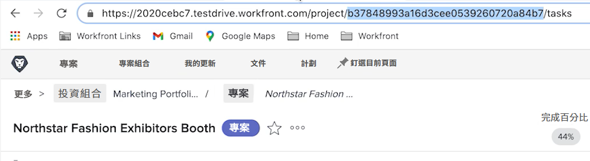
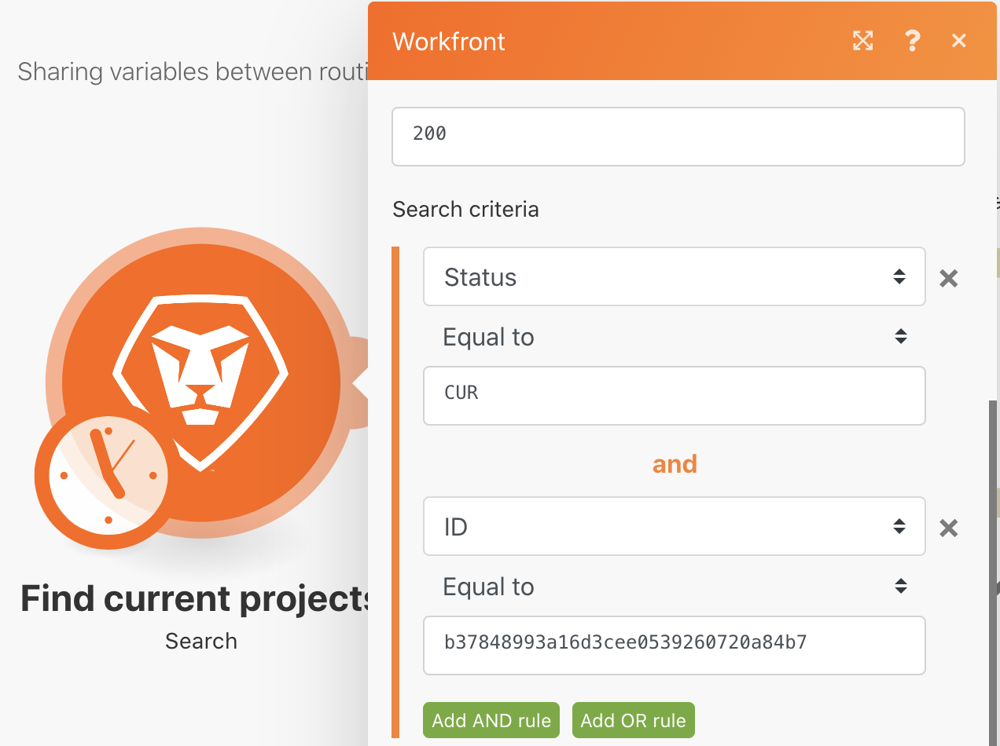

# Set/Get 變數練習

了解如何使用「Set 和 Get 變數」模組，讓一條路徑的可用欄位在不同的路徑上使用。

## 練習概觀

在 Workfront 中尋找有關專案的資訊並傳送包含相關資訊的電子郵件。

## 執行步驟

1. 建立新情境並命名為「在不同的路由路徑之間共用變數」。
1. 對於觸發程序，請選取 Workfront 應用程式中的搜尋模組。

   + 將「記錄類型」設為「專案」。
   + 對於「結果集」，請選擇「所有相符記錄」。
   + 對於「搜尋條件」，請設為「狀態等於 CUR」。
   + 對於「輸出」，選擇「ID」、「名稱」、「說明」和「發起人 ID」。

   

   

1. 按一下「確定」並把這個模組重新命名為「尋找目前的專案」。
1. 新增另一個模組並選取 Workfront「讀取一筆記錄」模組。

   + 對於「記錄類型」，選擇「使用者」。
   + 對於「輸出」，選擇「名稱」。
   + 將「發起人 ID」從搜尋模組對應到「ID」欄位。

1. 按一下「確定」。
1. 將模組重新命名為「尋找發起人名稱」。

   

1. 請儲存情境並按一下「執行一次」。

   如果「讀取一筆記錄」模組發生錯誤，可能是因為搜尋模組所尋找的專案並沒列出發起人。

   **要避免發生這個錯誤，請建立兩條路徑：一條用於擁有發起人 ID 的專案，另一條用於沒有發起人 ID 的專案。**

1. 按一下路由器與「讀取一筆記錄」模組之間的扳手圖示，在兩個模組之間新增一個路由器。設定名為「發起人存在」的篩選器，並把「條件」設為「發起人 ID 存在」。

   

1. 按一下路由器來建立另一條路徑。新增來自電子郵件應用程式的「傳送電子郵件」模組。

   + 將您的電子郵件地址填入「收件者」欄位。
   + 在「主旨」欄位中，輸入「目前專案資訊」。
   + 在「內容」欄位中，填入專案名稱、說明與發起人。
   + 您不能從「讀取一筆記錄」模組提取發起人名稱輸出。您只能從路由器之前的搜尋模組中存取發起人 ID。您必須找到方法從其他路由路徑存取發起人名稱。

   

1. 現在按一下「確定」，將這個模組重新命名為「傳送專案資訊」

   **使用 Set/Get 變數在不同路徑之間共用資料。**

1. 在「尋找發起人名稱」模組之後，新增一個「Set 變數」工具模組。

   + 將「發起人名稱」設為變數名稱。
   + 「變數期限」保持原本設定的「一個週期」。
   + 把欄位對應到來自「尋找發起人名稱」模組的名稱輸出。

1. 按一下「確定」，然後把模組重新命名為「Set 發起人名稱」。

   

1. 接著，在路由器和「傳送電子郵件」模組之間按一下右鍵，新增「Get 變數」工具模組。在「變數名稱」欄位輸入「發起人名稱」。
1. 按一下「確定」。將模組重新命名為「Get 發起人名稱」。

   

1. 返回「傳送電子郵件」模組並把來自「Get 發起人名稱」模組的值對應到內容欄位。按一下「確定」。

   

   >[!IMPORTANT]
   >
   >在測試情境之前，我們建議限制您處理的專案數量，以避免收到大量電子郵件。

1. 前往 Workfront 產品試用並找到「Northstar Fashion Exhibitors Booth」專案。這個目前的專案擁有發起人。從 URL 複製專案 ID。

   

1. 在您的情境中，按一下「尋找目前專案」模組。按一下綠色的「新增 AND 規則」按鈕，在搜尋條件中新增另一個條件。指定 ID 必須等於您複製的專案 ID。按一下「確定」。
1. 請儲存您的情境並按一下「執行一次」。
1. 檢閱執行檢查程式和您收到的電子郵件。

   
