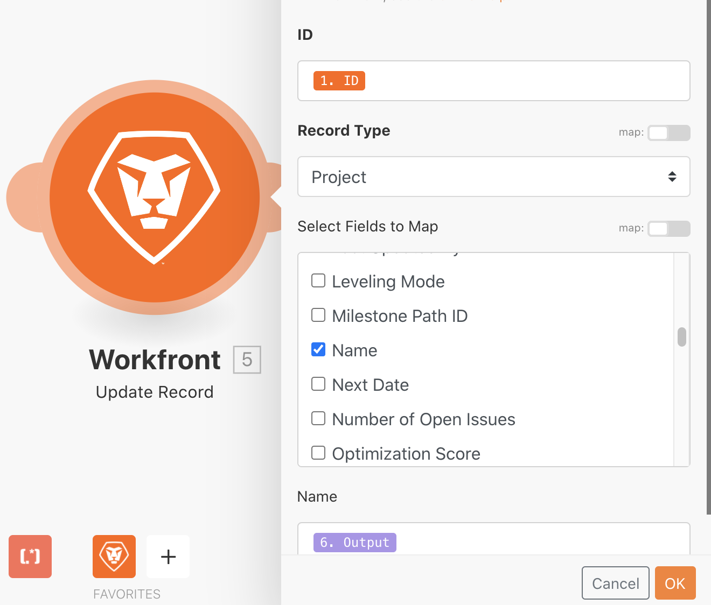

# 開關模組

了解在需要執行更複雜或動態資料轉換時如何使用Switch模組。

## 練習概觀

在測試驅動器中搜索直接郵件項目，然後根據在附加到項目的自定義欄位中選擇的值更改每個項目的名稱。

## 遵循步驟

1. 建立新情況，並將其命名為「使用交換機模組」。
1. 若為觸發程式模組，請使用Workfront搜尋模組。
1. 設定您的Workfront連線，並將記錄類型設為「專案」。
1. 在「搜尋」條件中，指定您只想查看在「管道」自訂欄位中具有值的專案。
1. 對於輸出，選擇ID、名稱、參考編號和通道自定義欄位。

   

1. 從「工具」中添加Switch模組。
1. 對於「輸入」欄位，從「搜尋」模組映射「管道」自訂欄位。

   

1. 接下來，為來自「管道」自訂欄位的每個可能值新增案例。 可能的值會進入「模式」欄位。 您希望輸出欄位包含特定的3個字母代碼，後面接著專案參考編號，然後是專案名稱。

   **您的對應面板應如下所示：**

   

1. 您可以新增任意數量的其他案例。 注意底部的「其他」欄位。 如果輸入值與任何案例都不符，就會使用此選項。

   **更新Workfront中的專案名稱。**

   

1. 新增Workfront更新記錄模組。
1. 在ID欄位中，對應至觸發模組的ID。
1. 將記錄類型設定為「項目」。
1. 從「選擇要映射的欄位」部分選擇「名稱」欄位，然後將其映射到Switch模組的輸出。
1. 儲存您的藍本並執行一次。 在您的測試驅動器中查看更新的項目名稱。
