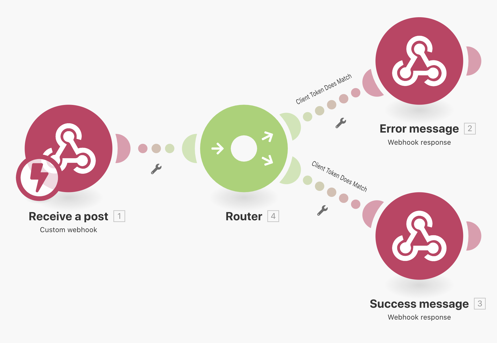
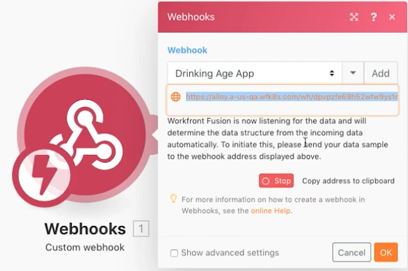

# Webhooks 練習

了解如何建立、觸發和管理 Webhook 啟動的情境。

## 練習概觀

這個情境的用途是建立一個銷售給便利商店的應用程式，讓他們可以輕鬆判斷客戶是否符合購買酒類的年齡限制。收銀員只需將客戶的姓名和出生日期發佈到所提供的 URL 上即可。該貼文將觸發情境來計算答案並傳回給請求者。

1. 情境由三個 Webhook 組成。
1. 觸發模組是偵聽貼文的自訂 Webhook。
1. 當它收到貼文時，便會把貼文輸出到其中一個後續模組。
1. 後續模組會傳回一個回應給請求者。

   

## 執行步驟

**設定觸發 Webhook。**

1. 建立新情境並命名為「使用 Webhook」。
1. 對於觸發程序，請新增來自 Webhook 應用程式的自訂 Webhook 模組。
1. 按一下「新增」，建立新 Webhook。
1. 輸入 Webhook 名稱「飲酒年齡應用程式」。
1. IP 限制請留白，表示任何人可以傳送資料到其中。
1. 按一下「儲存」。

   

1. 回到 Webhook 對應面板，這個特定 Webhook 的 URL 已建立完成。按一下「複製地址到剪貼簿」來複製該 URL。
1. 按一下「確定」。
1. 按一下「執行一次」。
1. 使用 Postman 中的 URL 將姓名和出生日期傳送到您的自訂 Webhook。有關設定 Postman 的指示，請參閱 [Webhooks 操作示範](https://experienceleague.adobe.com/docs/workfront-learn/tutorials-workfront/fusion/beyond-basic-modules/webhooks-walkthrough.html?lang=zh-Hant)教學課程。

   **Webhook 模組面板應如下所示：**

   

   **Webhook 現在處於偵聽資料以確認資料結構的狀態。**

1. 您可以定義預期取得的承載之資料結構 (稍後會討論資料結構)。如果您未定義資料結構，Fusion 將在傳送貼文時自動確認資料結構。
1. 在 Postman 端，您想要傳送到複製的 URL。該貼文應包括基本表單資料。在這個範例中，您需要三個欄位：「姓名」、「出生日期」和「clientToken」。

   

1. 您在 Postman 按一下「傳送」之後，應該會收到一項指示，表示貼文已被接受。
1. 到這個時候，您的情境將顯示已成功確認資料結構。
1. 您開啟執行檢查程式便可以看到已經接收資料。

   

   **設定用戶端語彙基元的路由。**

1. 新增路由器到觸發模組。
1. 在上面的路徑中，新增 Webhook 回應模組。當用戶端語彙基元不相符時，我們會依循這個路徑。
1. 將狀態設定為「401」。
1. 將正文設定為 {&quot;錯誤&quot;：&quot;無法驗證請求。請檢查您的用戶端語彙基元&quot;}。

   

1. 在路由器和 Webhook 回應模組之間建立篩選器。將其命名為「用戶端語彙基元不相符」。
1. 至於「條件」，請使用觸發模組的「clientToken」欄位，並針對數字「5121933」進行「不等於」的數值比較。

   

1. 在下面的路徑中，新增另一個 Webhook 回應模組。當用戶端語彙基元相符時，我們會依循這個路徑。
1. 將狀態設定為「200」。
1. 在設定「正文」時，使用對應面板函數來測試該名人員是否年滿 21 歲。若是，則傳回「您已經到了可以喝酒的年紀了！」，否則便傳回「您運氣不好...」

   

1. 在下面路徑的路由器和 Webhook 回應模組之間建立篩選器。將其命名為「用戶端語彙基元相符」。
1. 至於「條件」，請使用觸發模組的「clientToken」欄位，並針對數字「5121933」進行「等於」的數值比較。

   

1. 按一下「執行一次」之下的「排程」按鈕來啟動您的情境，在將會收到新貼文的任何時候，依循任何一條路徑並產生回應。
