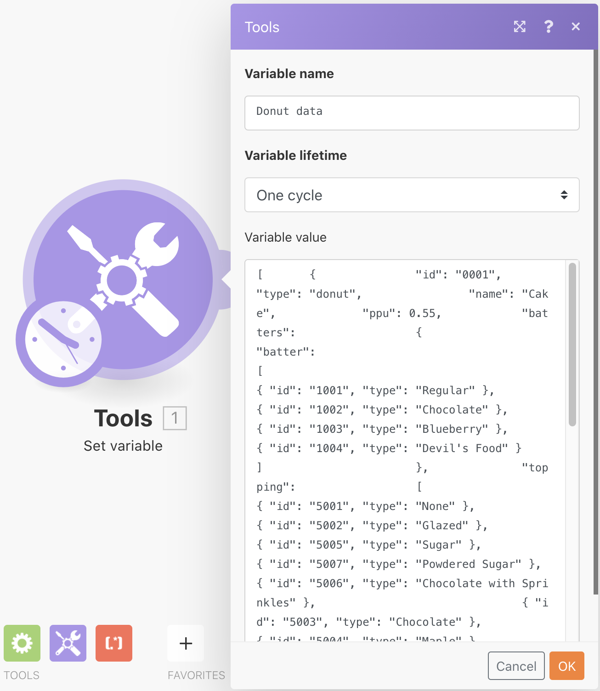

# 使用 JSON 練習

了解如何在情境中建立和剖析 JSON 以支援您的設計需求。

## 練習概觀

本練習的目的在於用概念性的方式說明如何使用以 JSON 格式傳送到情境中的資訊，將資訊剖析成為多個欄位和項目，以便對應到整個情境中。接著，您便可以從那些對應的陣列中擷取資訊，或是把資訊彙總成為 JSON 檔再傳送到另一個預期接受 JSON 輸入的系統。

## 執行步驟

**建立資料結構及剖析 JSON。**

1. 建立一個新情境並命名為「使用 JSON 甜甜圈資料」。
1. 觸發模組請使用「Set 變數」模組。
1. 對「變數名稱」請輸入「甜甜圈資料」。
1. 至於變數值，請把產品試用過程中的「Fusion Exercise Files」資料夾中「_Donut Data - Sample JSON.rtf」文件的內容複製並貼上。

   

1. 將這個模組重新命名為「來自另一個連接器的 JSON」。
1. 新增剖析 JSON 模組。
1. 在「資料結構」欄位中按一下「新增」。
1. 選取「產生器」並把您複製的「Donut Data - Sample JSON」資料貼到「範例資料」欄位中。

   

1. 按一下「儲存」把資料結構命名為「甜甜圈資料」。然後按一下「儲存」。
1. 把「Set 變數」模組的「甜甜圈資料」對應到「JSON 字串」欄位中。

   

1. 儲存您的情境，然後按一下「執行一次」來查看輸出。

   **剖析 JSON 模組的輸出應如下所示：**

   

   **對應到特定的陣列變數。**

1. 在剖析 JSON 模組之後新增一個路由器。
1. 在頂端路徑中，新增「Set 變數」模組。
1. 對「變數名稱」請輸入「甜甜圈的麵糊類型」。
1. 對「變數值」，請使用對應函數從「麵糊」陣列取得「麵糊」類型。

   

1. 按一下「確定」再按一下「執行一次」。
1. 開啟執行檢查程式來查看三項作業個別的輸出套件，顯示各自的「麵糊」類型。

   

   **將情境資料彙總成 JSON。**

1. 在下方的路由路徑中，新增「彙總成 JSON」模組。
1. 對於來源模組，請選擇疊代器「剖析 JSON 模組」。
1. 對於資料結構，請建立或選擇任何資料結構。這個範例請使用「甜甜圈資料」。
1. 直接對應這個範例中各個欄位，如下所示。
1. 當您到達「麵糊」和「餡料」區段，請注意這些都是陣列，所以您必須按一下「新增項目」才能對應。

   

1. 請儲存情境並按一下「執行一次」。

查看「彙總成 JSON」模組的執行檢查程式，注意您是如何把三個套件彙總成為單一 JSON 字串。接著您可以把這個字串傳送到預期接收 JSON 的其他系統。

