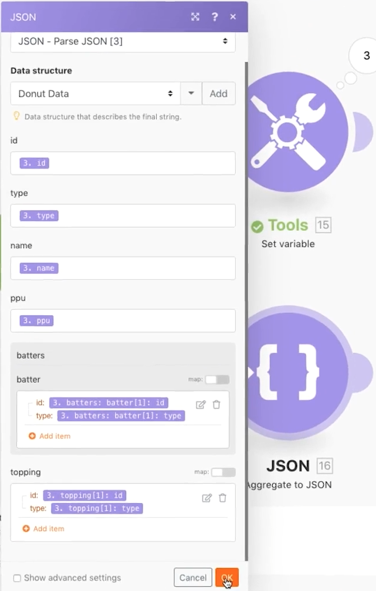

# 使用JSON

瞭解如何在情境中建立和剖析JSON，以支援您的設計需求。

## 練習概述

本練習的目的是在概念上展示如何運用JSON格式傳送至案例的資訊，將其剖析為可在整個案例中對應的欄位和專案。 然後，您可以從這些對應陣列中擷取資訊，或將這些資訊彙總到JSON中，然後傳送至預期JSON會作為接收輸入的另一個系統。

## 要遵循的步驟

**建立資料結構並剖析JSON。**

1. 建立新情境並將其命名為「使用JSON環形資料」。
1. 對於觸發程式模組，請使用設定變數模組。
1. 變數名稱請輸入「環形資料」。
1. 針對變數值，複製並貼上在您的測試磁碟機的Fusion Experience Files資料夾中找到的「_Donut Data - Sample JSON.rtf」檔案的內容。

   

1. 將此模組重新命名為「來自其他聯結器的JSON」。
1. 新增剖析JSON模組。
1. 按一下「資料結構」欄位的新增。
1. 選取「產生器」並貼上您複製到「範例資料」欄位中的「環形資料 — 範例JSON」資料。

   

1. 按一下儲存，將資料結構命名為「環形圖資料」。 然後按一下「儲存」。
1. 將環圈圖資料從設定變數模組對應至JSON字串欄位。

   

1. 儲存情境，然後按一下「執行一次」以檢視輸出。

   **剖析JSON模組的輸出應如下所示：**

   

   **對應至特定陣列變數。**

1. 在Parse JSON模組後新增路由器。
1. 在頂端路徑中，新增Set變數模組。
1. 在「變數」名稱中，輸入「透過環形圖篩選批次型別」。
1. 對於「變數」值，請使用map函式，從電池陣列中取得電池型別。

   

1. 按一下「確定」，然後按一下「執行一次」。
1. 開啟執行檢測器以檢視三個作業中每一個作業的輸出組合，顯示每一個作業的批次型別。

   

   **將情境資料彙總為JSON。**

1. 在下層路由路徑中，新增彙總至JSON模組。
1. 對於「來源模組」，請選擇迭代器 — 「剖析JSON」模組。
1. 對於資料結構，請建立或選擇任何資料結構。 在此範例中，使用環形圖資料。
1. 請繼續並直接將欄位對應到下列範例中。
1. 當您進入擊球手和擊球手時，請注意這些是陣列，因此您需要按一下「新增專案」來對應它們。

   

1. 儲存情境並按一下「執行一次」。

檢視Aggregate to JSON模組的執行檢測器，並注意您如何將三個套件組合彙總為單一JSON字串。 然後，您可以將此字串傳送至預期JSON的其他系統。

