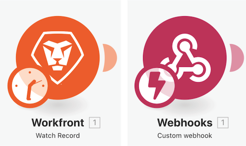

# 存取之前版本操作示範

觀看這段影片，您將：

* 探索在您已經變更情境設定並且儲存數次之後，如何還原前一版本的情境。

## 存取之前版本操作示範

Workfront 建議先觀看練習的操作示範影片，然後再嘗試在您自己的環境中重新建立練習。

>[!VIDEO](https://video.tv.adobe.com/v/335268/?quality=12&learn=on&enablevpops=1)

>[!NOTE]
>
>儲存您的案例後，Workfront Fusion會保留上一個案例版本60天。 版本的保留期間從該版本被較新版本取代時開始，而不是最初建立版本時。
>若要保留超過60天的案例版本歷史記錄以供稽核之用，請將案例藍圖儲存並封存至同意的位置。

## 新增到您的術語

### 觸發模組

觸發模組僅可用作第一個模組，並可以傳回零個、一個或更多個套件。 這些將會在後續的模組中個別處理，除非已彙總。

**輪詢觸發 (觸發程序上顯示時鐘)**— 追蹤所處理的最後一筆記錄的特殊功能。

**即時觸發 (觸發程序上顯示閃電)**— 根據 Webhook 立即觸發。

### 動作與搜尋模組

**動作** — 用於執行 CRUD (建立、讀取、更新和刪除) 操作

**搜尋** — 用於搜尋零個、一個或多個記錄並以套件形式傳回這些結果，接著在後續的模組中個別進行處理，除非已彙總。

## 想要瞭解更多嗎？ 我們建議參閱以下資訊：

[Workfront Fusion 文件](https://experienceleague.adobe.com/en/docs/workfront-fusion/using/get-started-with-fusion/understand-workfront-fusion/workfront-fusion-overview)
