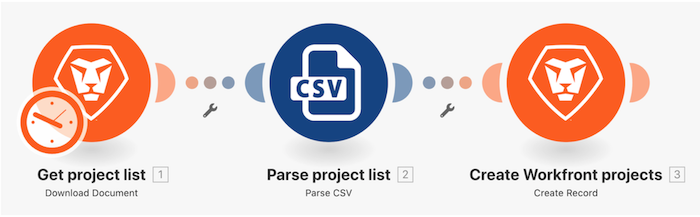

# 初始方案設計逐步說明

## 總覽

在Workfront中為專案清單CSV檔案中的每一列建立新專案。

Workfront建議您先觀看練習逐步影片，然後再嘗試在自己的環境中重新建立練習。

在此影片中，您將學習如何：

* 建立資料夾和新方案
* 使用方案設計器
* 建立基本藍本

>[!VIDEO](https://video.tv.adobe.com/v/335261/?quality=12&learn=on)

>[!TIP]
>
>如需完成逐步說明，請前往 [初始案例設計逐步說明](https://experienceleague.adobe.com/docs/workfront-learn/tutorials-workfront/fusion/exercises/initial-scenario-design.html?lang=en) 練習。

## 想要進一步了解嗎？ 我們建議下列項目：

[Workfront Fusion檔案](https://experienceleague.adobe.com/docs/workfront/using/adobe-workfront-fusion/workfront-fusion-2.html?lang=en)
