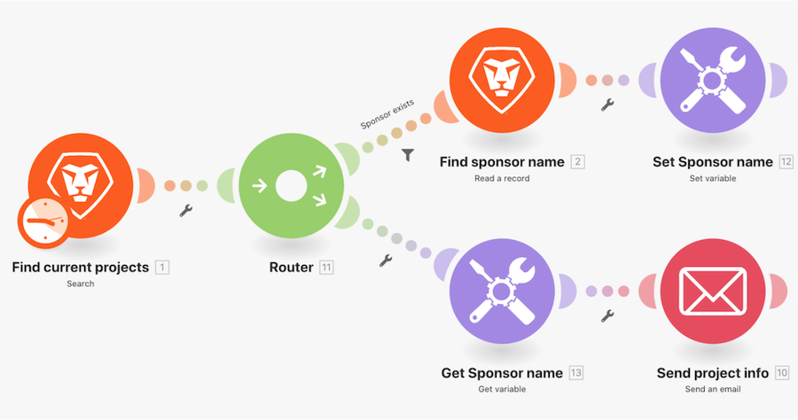

# Set/Get 變數操作示範

在 Workfront 中尋找有關專案的資訊並傳送包含相關資訊的電子郵件。

## Get/Set 變數操作示範

Workfront 建議先觀看練習的操作示範影片，然後再嘗試在您自己的環境中重新建立練習。

>[!VIDEO](https://video.tv.adobe.com/v/335276/?quality=12&learn=on)

## 換您來操作

>[!NOTE]
>
>您可以選擇實作練習與挑戰，但這不是完成 Fusion 培訓的必要條件。

本實作練習以您在操作示範中學到的知識為基礎，但未提供解決方案。

原地複製您在此操作示範中建立的「在路由路徑之間共用變數」情境。把您撰寫的訊息用電子郵件發送給專案所有者和專案贊助者。您也想在訊息中說明專案的狀況。(在這個階段，狀況只顯示兩個字母並沒有問題。)

**挑戰：**&#x200B;安排您的情境在每週一上午 8 點發送此「電子郵件」。

## 想要瞭解更多嗎？我們建議參閱以下資訊：

[Workfront Fusion 文件](https://experienceleague.adobe.com/docs/workfront/using/adobe-workfront-fusion/workfront-fusion-2.html?lang=zh-Hant)
