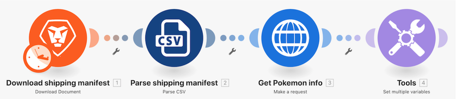

# 通用連接器操作示範簡介

## 概觀

使用試算表中的寶可夢角色，經由 HTTP 連接器呼叫 Poke API 來收集及張貼關於該角色的更多資訊。

## 通用連接器操作示範簡介

Workfront 建議先觀看練習的操作示範影片，然後再嘗試在您自己的環境中重新建立練習。

>[!VIDEO](https://video.tv.adobe.com/v/335270/?quality=12&learn=on)

### 練習 URL

寶可夢 API 網站：`https://pokeapi.co/`

練習 URL：`https://pokeapi.co/api/v2/pokemon/{Character}`

>[!TIP]
>
>如需完成操作示範的逐步指示，請前往[通用連接器操作示範簡介](https://experienceleague.adobe.com/docs/workfront-learn/tutorials-workfront/fusion/exercises/introduction-to-universal-connectors.html?lang=zh-Hant)練習。

## 想要瞭解更多嗎？我們建議參閱以下資訊：

[Workfront Fusion 文件](https://experienceleague.adobe.com/docs/workfront/using/adobe-workfront-fusion/workfront-fusion-2.html?lang=zh-Hant)
