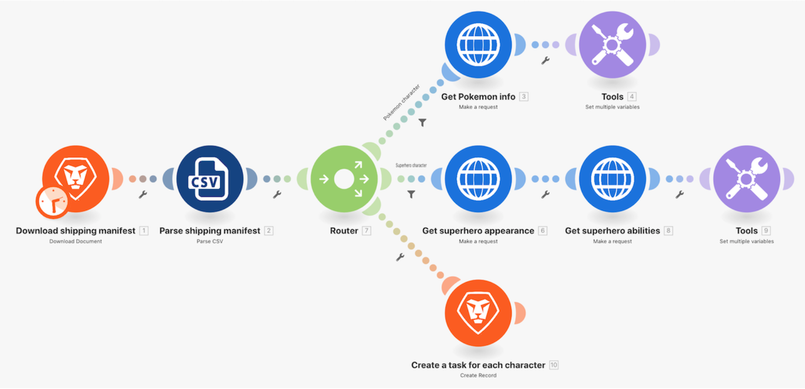

# 路由器操作示範

使用路由器將寶可夢與超級英雄套件依正確路徑傳遞，並為每個角色建立一項任務。

## 路由器操作示範

Workfront 建議先觀看練習的操作示範影片，然後再嘗試在您自己的環境中重新建立練習。

>[!VIDEO](https://video.tv.adobe.com/v/335272/?quality=12&learn=on)

## 練習 URL

* 超級英雄 API 網站：`https://www.superheroapi.com/`
* 練習用的第一個 URL：`https://www.superheroapi.com/api/{access-token}/{character-id}/appearance`
* 練習用的第二個 URL：`https://www.superheroapi.com/api/{access-token}/{character-id}/powerstats`

若您無法存取自己的超級英雄語彙基元，您可以使用這個共用語彙基元：10110256647253588。關於呼叫超級英雄 API 的次數，請多考慮他人的權益，讓這個共用的語彙基元可以供所有人使用。

## 在對應面板中搜尋項目

對應面板頂端的「搜尋項目」欄位可以快速尋找面板中的欄位，包括陣列中的巢狀欄位。搜尋不區分大小寫。

## 使用 API 的提示和技巧

到目前為止，您使用的是非常簡單的 API (應用程式介面)，它不需要額外的身分驗證即可從情境中提取所需資訊。以下是協助您瞭解如何使用 API 和通用連接器的提示。

## 步驟 1：確定 API 的類型

Workfront 和許多軟體系統都是使用 REST (具象狀態傳輸) API 建置，這是現在最簡單、最標準的 API 類型。不過尚有其他一些類型，例如：

* SOAP (簡易物件存取通訊協定) (Workfront 的校訂 API 是 SOAP 型)
* FTP (檔案傳輸通訊協定)
* SFTP (安全檔案傳輸協定)
* 要瞭解更多資訊，請在網路上搜尋 API 類型及感興趣的關鍵字。

>[!NOTE]
>
>當連接大型平台 (例如 Salesforce) 時，這些平台的不同區域將提供不同的 API。請您務必針對所要連接的服務尋找適當的 API。

## 步驟 2：確定 API 所需的驗證類型

API 驗證是一種控制服務存取的身分識別形式，例如當您想要透過 Workfront Fusion 進行連線時。此驗證方式協助您向另一個系統證明您獲得存取系統的授權。OAuth 2 是現在人們最常使用的驗證類型。如需深入瞭解，請在網際網路上搜尋關於 API 驗證的資訊。

身分驗證可能是使用 API 時最困難的方面。Workfront Fusion 通用連接器最重要的功能之一，就是在您使用常見的驗證方法例如 OAuth 2、API 金鑰等基本驗證時，協助您處理驗證作業。在您選取適當的 Workfront Fusion 模組供驗證方法 (例如 OAuth 2) 使用並建立連線之後，每次您要執行情境時，Workfront Fusion 將持續產生 API 金鑰和/或語彙基元。

請參閱 Experience League 上有關增強型驗證概觀的文章，瞭解 Workfront 提供的不同類型的驗證。

## 步驟 3：閱讀 API 文件並找到所需的端點

當 API 與另一個系統互動時，此通訊的接觸點就是端點。端點是 API 傳送請求的地方，也是資源所在之處。

使用通用連接器與 API 互動時，您必須瞭解 API 支援哪些端點以及每項請求需要哪些資料。API 文件應有說明 API 端點以及如何執行常見作業，例如建立、讀取、更新或刪除。執行這些呼叫需要練習，若您沒有進行 API 呼叫或是使用新 API 的經驗，則練習尤為重要。

在 Experience League 上深入瞭解 Workfront Fusion 通用連接器以及如何設定連接器以便連接所需的 API。

## 最後提醒

您可以在 Experience League 中查看我們預先建立的應用程式連接器的完整清單。若您想要向 Workfront Fusion 產品團隊建議使用新的應用程式連接器，請把您的想法提交給 Innovation Lab。若您不曾提交過意見，請深入瞭解 Innovation Lab，以及如何參加新構思投票及一年兩次的構思排行榜優先執行活動。若您已經擁有 Innovation lab 的存取權，請登入並提交您的想法。

## 換您來操作

>[!NOTE]
>
>您可以選擇實作練習與挑戰，但這不是完成 Fusion 培訓的必要條件。

本實作練習以您在操作示範中學到的知識為基礎，但未提供解決方案。

在寶可夢角色的「設定多個變數」模組中，建立一個名為「統計數據 (等級)」的變數。將寶可夢統計的名稱對應到這個變數。使用陣列值的功能來變更陣列的顯示方式，好讓每項統計數據都是新的一行，如下所示。

**提示：**&#x200B;只有六種不同的寶可夢統計數據具有對應的等級。

**挑戰：**&#x200B;您是否可以使用陣列公式來擷取「能力」，並依上述方式，以不同的列顯示，而不是以逗號分隔的字串值。下方螢幕擷圖有一項提示。

## 想要瞭解更多嗎？我們建議參閱以下資訊：

[Workfront Fusion 文件](https://experienceleague.adobe.com/docs/workfront/using/adobe-workfront-fusion/workfront-fusion-2.html?lang=zh-Hant)
