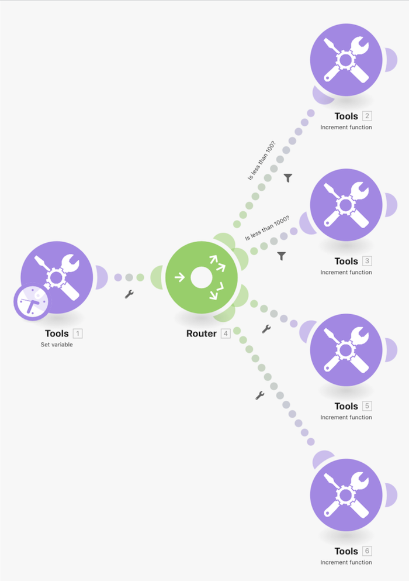

# 路由模式操作示範

使用「Set 變數」模組傳送一個數字通過多條路徑，了解路由時篩選器和後援機制的運作。

## 路由模式操作示範

Workfront 建議先觀看練習的操作示範影片，然後再嘗試在您自己的環境中重新建立練習。

>[!VIDEO](https://video.tv.adobe.com/v/335274/?quality=12&learn=on&enablevpops=1)

## 想要了解更多嗎？我們建議參閱以下資訊：

[Workfront Fusion 文件](https://experienceleague.adobe.com/en/docs/workfront-fusion/using/get-started-with-fusion/understand-workfront-fusion/workfront-fusion-overview)
