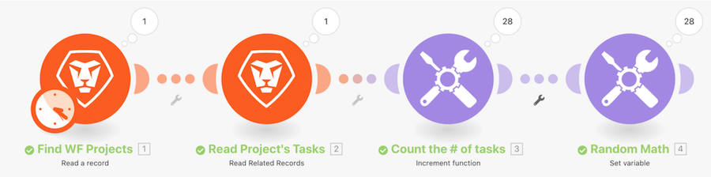

# 疊代器簡介操作示範

查看 Workfront 中的特定專案，然後查看該專案中所有任務。 然後，您將使用增量工具模組來計算專案中的任務數量，最後，您將使用 Set 變數模組從「未決問題數量」減去「子系數量」，為每個任務套件產生一個數值。

## 疊代器簡介操作示範

Workfront 建議先觀看練習的操作示範影片，然後再嘗試在您自己的環境中重新建立練習。

>[!VIDEO](https://video.tv.adobe.com/v/335278/?quality=12&learn=on&enablevpops=1)

## 想要了解更多嗎？ 我們建議參閱以下資訊：

[Workfront Fusion 文件](https://experienceleague.adobe.com/zh-hant/docs/workfront-fusion/using/get-started-with-fusion/understand-workfront-fusion/workfront-fusion-overview)
