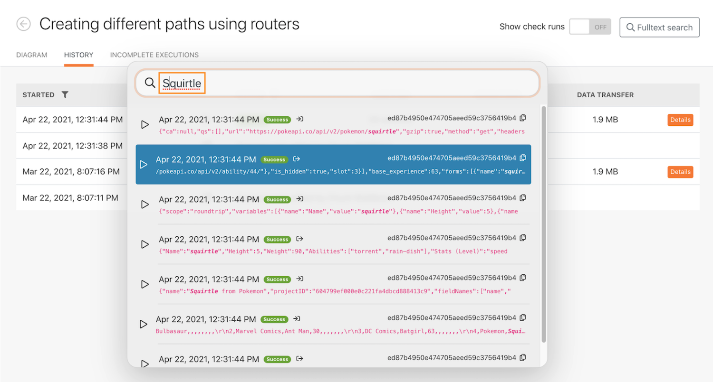
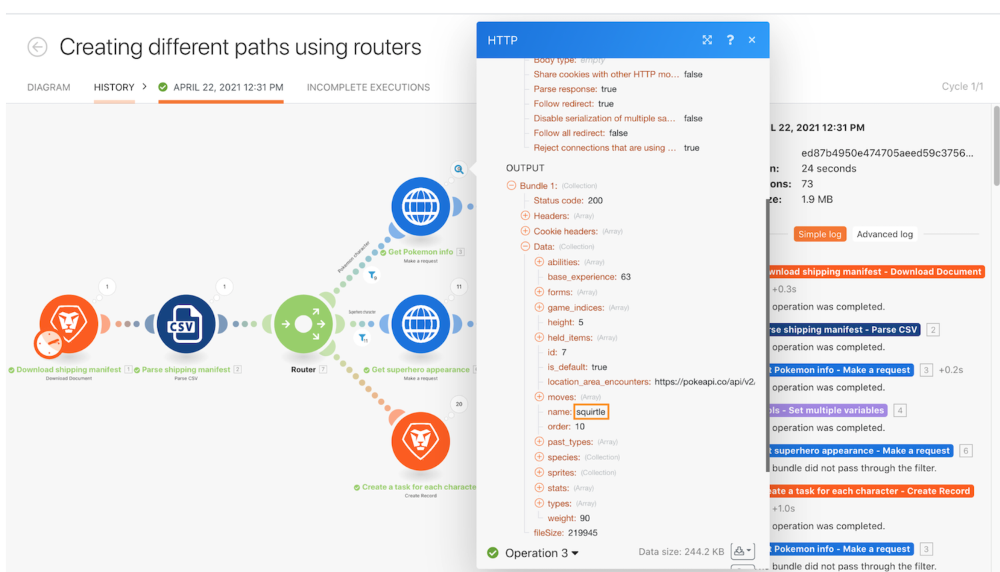

# 執行歷史記錄操作示範

審閱「使用功能強大的篩選器」情境的執行歷史記錄，來瞭解執行時發生什麼事以及他們在執行時的結構。

## 執行歷史記錄操作示範

Workfront 建議先觀看練習的操作示範影片，然後再嘗試在您自己的環境中重新建立練習。

>[!VIDEO](https://video.tv.adobe.com/v/335283/?quality=12&learn=on&enablevpops=1)

## 在歷史記錄標籤中進行全文搜尋

情境的歷史記錄標籤可進行全文搜尋，讓您可以搜尋情境中處理過的任何資料。

與其開啟每個執行記錄來搜尋資料，全文搜尋涵蓋單一情境中所有執行記錄。 搜尋結果將找到的資料的執行記錄列成清單，您可以點選任何執行記錄來進一步探索。

搜尋結果中包含下圖一些實用圖示。

A — 執行狀態。

B — 資料是在模組的輸入或輸出中找到。

C — 執行 ID。

D — 複製執行 ID。

當您按一下執行記錄時，Workfront Fusion 載入找到搜尋結果的執行記錄和模組。 它會開啟包含搜尋資料的模組上的執行檢查程式。

## 想要瞭解更多嗎？ 我們建議參閱以下資訊：

[Workfront Fusion 文件](https://experienceleague.adobe.com/en/docs/workfront-fusion/using/get-started-with-fusion/understand-workfront-fusion/workfront-fusion-overview)
