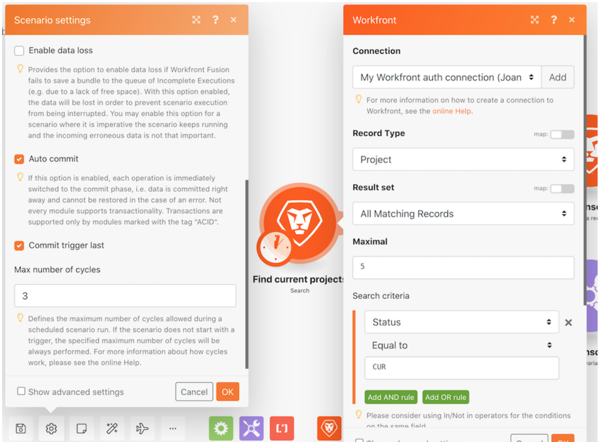

# 執行、週期和套件操作示範

練習不同的情境設定，探索如何使用執行與週期。

## 執行、週期和套件操作示範

Workfront 建議先觀看練習的操作示範影片，然後再嘗試在您自己的環境中重新建立練習。

>[!VIDEO](https://video.tv.adobe.com/v/335286/?quality=12&learn=on&enablevpops=1)

## 想要了解更多嗎？ 我們建議參閱以下資訊：

[Workfront Fusion 文件](https://experienceleague.adobe.com/zh-hant/docs/workfront-fusion/using/get-started-with-fusion/understand-workfront-fusion/workfront-fusion-overview)
