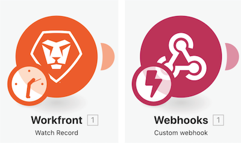

# 熟悉其他應用程式與常用模組

## 模組類型提醒

### 觸發模組

僅可用作第一個模組，並可以傳回零個、一個或更多個套件，而這些套件會在後續的模組中個別進行處理，除非已彙總。

* **即時觸發** (觸發程序上顯示閃電) — 根據 Webhook 立即觸發。
* **排程觸發** (觸發程序上顯示時鐘) — 追蹤所處理的最後一筆記錄的特殊功能。

### 動作與搜尋模組

* **動作** — 用於執行 CRUD (建立、讀取、更新和刪除) 操作。
* **搜尋** — 用於搜尋零個、一個或多個記錄並以套件形式傳回這些結果，接著在後續的模組中個別進行處理，除非已彙總。

### 熟悉其他應用程式與常用模組

觀看這段影片，您將會瞭解：

* 觸發程序、動作和搜尋是什麼以及他們之間的差異
* 在不同的應用程式連接器中找到的各類型模組及其如何作用

>[!VIDEO](https://video.tv.adobe.com/v/335287/?quality=12&learn=on)
