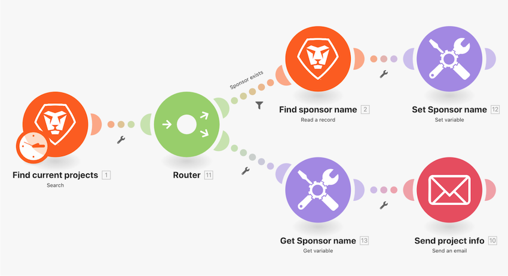

# 切換函數操作示範

若是簡單的資料變更，可使用切換函數在模組欄位以內將一個值轉換成另一個值。在這項練習中，為了傳送電子郵件，把專案進度狀態的兩個字母縮寫變更為實際名稱。

## 切換函數操作示範

Workfront 建議先觀看練習的操作示範影片，然後再嘗試在您自己的環境中重新建立練習。

>[!VIDEO](https://video.tv.adobe.com/v/335289/?quality=12&learn=on&enablevpops=1)

## 想要了解更多嗎？我們建議參閱以下資訊：

[Workfront Fusion 文件](https://experienceleague.adobe.com/en/docs/workfront-fusion/using/get-started-with-fusion/understand-workfront-fusion/workfront-fusion-overview)
