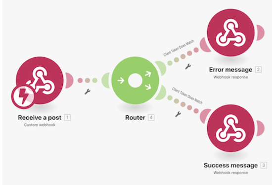

# Webhook 操作示範

此情景建立一個便利超商應用程式，讓他們可以輕鬆判斷客戶是否符合購買酒類的年齡限制。收銀員只需將客戶的姓名和出生日期以及經過驗證的用戶端語彙基元發佈到所提供的 URL 即可。輸入後，便會觸發我們的情境來計算適當的回應並傳回給請求者。

## Webhook 操作示範

Workfront 建議先觀看練習的操作示範影片，然後再嘗試在您自己的環境中重新建立練習。

>[!VIDEO](https://video.tv.adobe.com/v/335292/?quality=12&learn=on&enablevpops=1)

## Postman 設定

若要跟隨著操作示範一起練習，您必須下載免費的 Postman 應用程式。按照以下步驟導覽到 Postman 的右側區域進行練習。

1. 建立一個工作區，然後開啟該工作區。
1. 按一下「新增」標籤，然後建立一個新集合，名為「飲酒年齡」。
1. 再次按一下「新增」標籤並建立一個新的 GET 請求，名為「GET 出生日期」。
1. 將請求動作從 GET 變更為 POST。
1. 前往「POST URL」欄位下方的「正文」子標籤區域。
1. 選擇「授權」子標籤下方的表單資料。
1. 建立三個索引鍵「姓名」、「出生日期」和「clientToken」。

## 換您來操作

>[!NOTE]
>
>您可以選擇實作練習與挑戰，但這不是完成 Fusion 培訓的必要條件。

本實作練習以您在操作示範中學到的知識為基礎，但未提供解決方案。

建立一個 Workfront Webhook，等待新的更新內容建立後，便記錄日期、進行更新的人員名稱以及更新內容。把這些資訊用電子郵件傳送給自己。

**提示**：使用 Workfront Watch Events 觸發模組來建立 Webhook。此外，在 Workfront 中，更新稱為備註。

**挑戰**：您能否找到並新增進行更新的 URL，使之更方便存取？

## 想要瞭解更多嗎？我們建議參閱以下資訊：

[Workfront Fusion 文件](https://experienceleague.adobe.com/en/docs/workfront-fusion/using/get-started-with-fusion/understand-workfront-fusion/workfront-fusion-overview)
