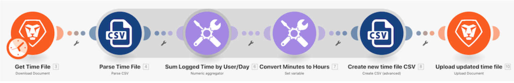

# 資料結構逐步說明

## 總覽

開啟包含時間項目清單的CSV檔案。 這些時間項目是多位使用者在特定日期記錄的分鐘數。 目標是取用這項資訊並產生新的CSV，以小時為單位顯示每位使用者每天記錄的總時間。

## 資料結構逐步說明

Workfront建議您先觀看練習逐步影片，然後再嘗試在自己的環境中重新建立練習。

>[!VIDEO](https://video.tv.adobe.com/v/335294/?quality=12&learn=on)

>[!TIP]
>
>如需完成逐步說明，請前往 [資料結構逐步說明](https://experienceleague.adobe.com/docs/workfront-learn/tutorials-workfront/fusion/exercises/data-structures.html?lang=en) 練習。

## 想要進一步了解嗎？ 我們建議下列項目：

[Workfront Fusion檔案](https://experienceleague.adobe.com/docs/workfront/using/adobe-workfront-fusion/workfront-fusion-2.html?lang=en)
