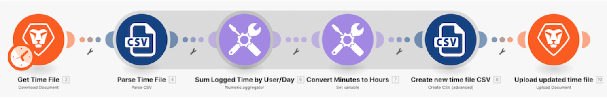

# 資料結構操作示範

開啟含有時間記錄清單的 CSV 檔案。 這些時間記錄是多位使用者在某幾天內記錄的分鐘數。 目標是擷取這些資訊並產生新的 CSV 檔，顯示每位使用者每天記錄的總時數 (以小時為單位)。

## 資料結構操作示範

Workfront 建議先觀看練習的操作示範影片，然後再嘗試在您自己的環境中重新建立練習。

>[!VIDEO](https://video.tv.adobe.com/v/335294/?quality=12&learn=on&enablevpops=1)

## 想要了解更多嗎？ 我們建議參閱以下資訊：

[Workfront Fusion 文件](https://experienceleague.adobe.com/zh-hant/docs/workfront-fusion/using/get-started-with-fusion/understand-workfront-fusion/workfront-fusion-overview)
