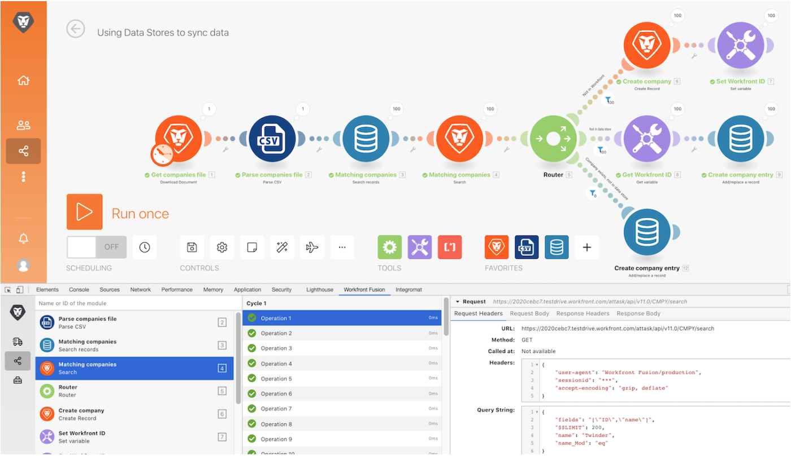

# 開發工具操作示範

安裝 Workfront 開發工具並使用其中不同的區域，深入瞭解所提出請求/回應以及進階的情境設計技巧。

## 開發工具操作示範

Workfront 建議先觀看練習的操作示範影片，然後再嘗試在您自己的環境中重新建立練習。

>[!VIDEO](https://video.tv.adobe.com/v/335303/?quality=12&learn=on&enablevpops=1)

## 下載開發工具

開發工具擁有多項可以提升能力的進階功能，協助您理解情境和進行疑難排解。 請下載產品試用過程中的「Fusion Exercise Files」資料夾中的文件「workfront-fusion-devtool.zip」。

## 想要瞭解更多嗎？ 我們建議參閱以下資訊：

[Workfront Fusion 文件](https://experienceleague.adobe.com/en/docs/workfront-fusion/using/get-started-with-fusion/understand-workfront-fusion/workfront-fusion-overview)
