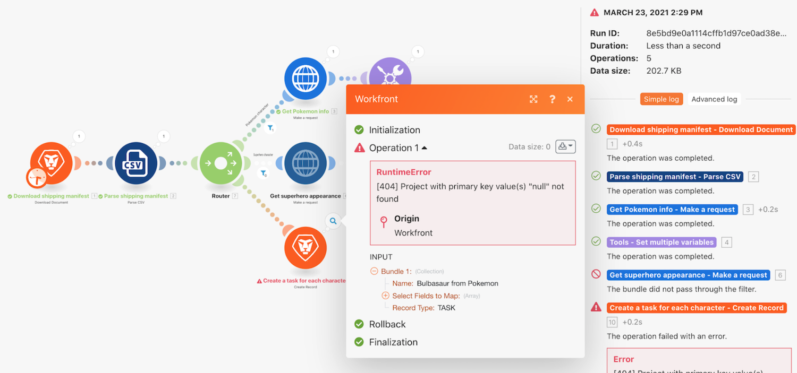

# 錯誤處理操作示範

瞭解在什麼情況下會執行預設的錯誤處理，以及如何利用指示來新增特定模組錯誤處理功能。

## 錯誤處理操作示範

Workfront 建議先觀看練習的操作示範影片，然後再嘗試在您自己的環境中重新建立練習。

>[!VIDEO](https://video.tv.adobe.com/v/335306/?quality=12&learn=on&enablevpops=1)

## 想要瞭解更多嗎？ 我們建議參閱以下資訊：

[Workfront Fusion 文件](https://experienceleague.adobe.com/en/docs/workfront-fusion/using/get-started-with-fusion/understand-workfront-fusion/workfront-fusion-overview)
