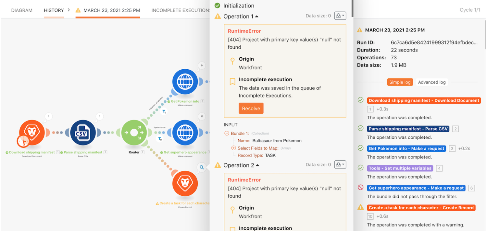

# 未完成的執行作業操作示範

學習儲存未完成之執行作業的實用習慣，並瞭解在評估和修正錯誤之後重新執行套件時這個習慣所帶來的價值。

## 未完成的執行作業操作示範

Workfront 建議先觀看練習的操作示範影片，然後再嘗試在您自己的環境中重新建立練習。

>[!VIDEO](https://video.tv.adobe.com/v/335308/?quality=12&learn=on&enablevpops=1)

## 想要了解更多嗎？ 我們建議參閱以下資訊：

[Workfront Fusion 文件](https://experienceleague.adobe.com/zh-hant/docs/workfront-fusion/using/get-started-with-fusion/understand-workfront-fusion/workfront-fusion-overview)
