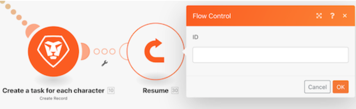
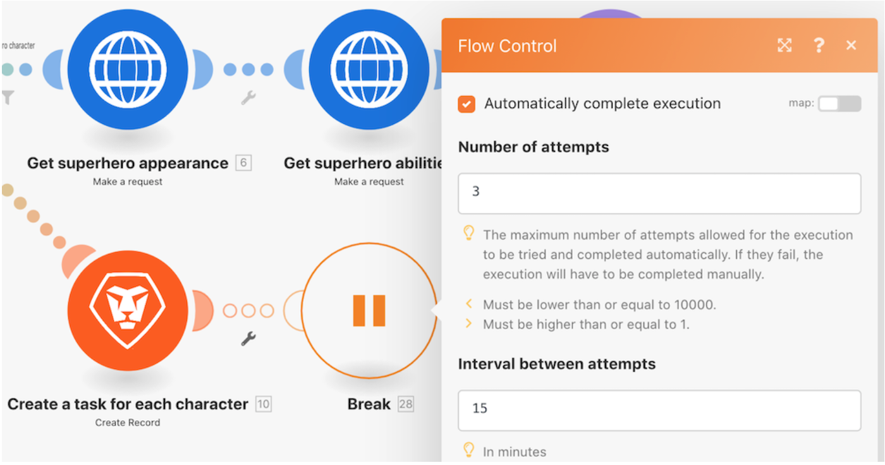

# 瞭解錯誤處理指示

觀看這段影片，您將會瞭解：

* 允許繼續執行的三個錯誤處理常式指示
* 使執行停止的兩個錯誤處理常式指示

>[!VIDEO](https://video.tv.adobe.com/v/335305/?quality=12&learn=on&enablevpops=1)

## 指示 — 情境繼續

### 繼續

* 指定替代輸出並提供給發生錯誤的模組。
* 接著處理後續的模組。
* 情境執行狀態標記為「成功」。

### 中斷

* 情境執行的狀態儲存在未完成執行作業的佇列中，而錯誤可以手動解決。不過也有一些例外狀況，如此處所述。
* 後續的模組並未進行處理。
* 若有未處理的套件，情境執行將按正常情況繼續。
* 情境執行狀態標記為「警告」。

### 忽略

* 忽略錯誤，而且不處理後續的模組。
* 若有未處理的套件，情境執行將按正常情況繼續。
* 情境執行狀態標記為「成功」。

## 指示 — 情境停止

### 復原

* 情境執行立即停止，並在所有模組上啟動復原階段，試圖將它們全部恢復到初始狀態。
* 後續的模組並未進行處理。
* 除少數錯誤類型外，在到達「情境」設定下指定的「連續錯誤數」之後，該情境將被停用。
* 情境執行狀態標記為「錯誤」。

>[!NOTE]
>
>如果模組上並未附加任何錯誤處理常式，而且未勾選「情境」設定之下的「允許儲存未完成的執行作業」設定，這是預設的行為。

### 認可

* 忽略錯誤，而且不處理後續的模組。
* 若有未處理的套件，情境執行將按正常情況繼續。
* 情境執行狀態標記為「成功」。

