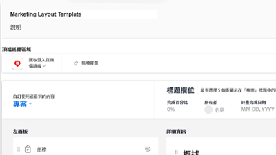
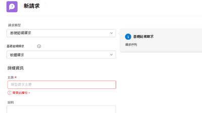
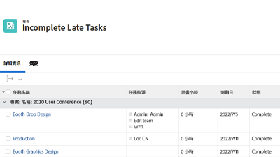

# WorkfrontTutorials {#overview}

訓練影片和文章的資料庫，旨在協助您更清楚了解Workfront功能和設定。  其中包含最佳實務、策劃的練習和其他資源，可協助您和您的組織成功使用Workfront。

>[!VIDEO](https://video.tv.adobe.com/v/335063/?quality=12)

<!-- 

This is the landing page of the user guide. It should be the first list item in the TOC.md file. 
See other user landing pages to get ideas. 

-->

## 最新資訊?

探索每個Workfront產品版本的教學課程最新更新。 以下是最新版本的更新內容：

* 在Workfront的頂端導覽中，我的最愛和收件者圖示已分隔。 您可在 <a href="/help/manage-work/projects/find-projects.md">尋找專案</a> 教學課程。

* 設定自訂表單以搭配多個物件類型使用。 請參閱 <a href="/help/custom-data/custom-forms/custom-forms-creating-and-sharing-a-custom-form.md">建立和共用自訂表單</a> 教學課程。

## 員工精選

<table>
  <tr>
   <td>
      
      

         <a href="/help/administration-and-setup/layout-templates/find-layout-templates.md"><strong>尋找和建立版面範本</strong></a>
<!----          <em>foo</em> --->
      

      

         
         了解如何建立基本版面範本。
      

    </td>
   <td>
      
      

         <a href="/help/manage-work/issues-requests/make-a-request.md"><strong>提出請求</strong></a>
<!----          <em>foo</em> --->
      

      

       
         了解如何提出、檢視和編輯請求。
      

<td>
      
      

         <a href="/help/reporting/basic-reporting/create-a-simple-report.md"><strong>建立簡單報表</strong></a>
<!----          <em>foo</em> --->
      

      

         
         了解如何建立簡單的自訂報表。
      

    </td>
  </tr>
</table>
