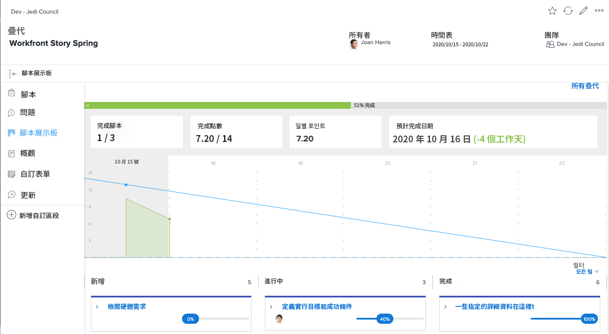
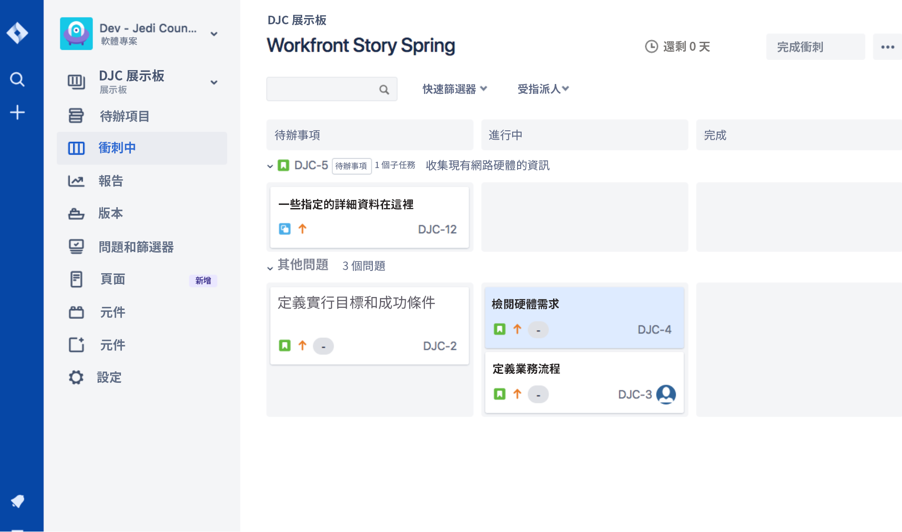
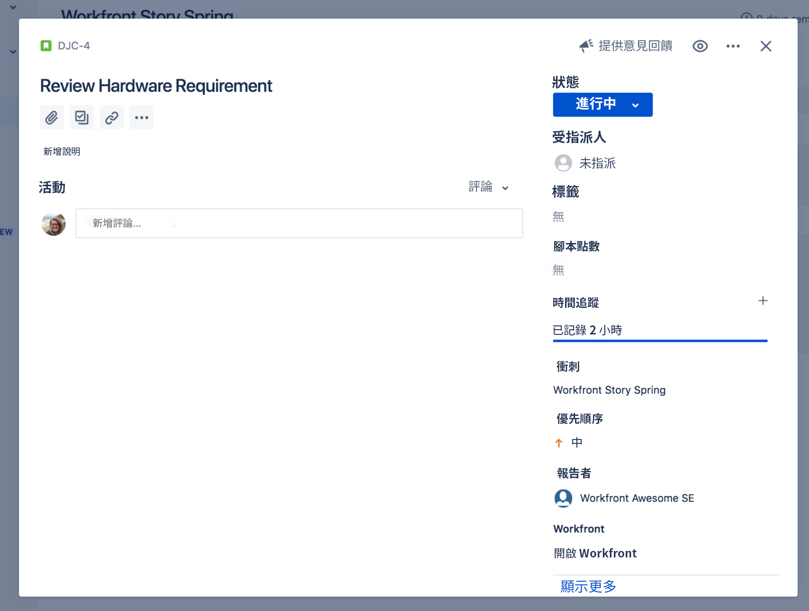
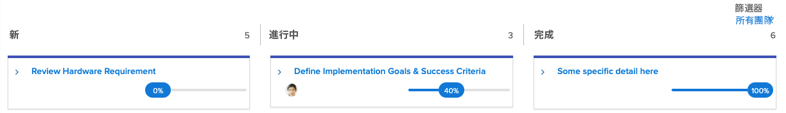

# 利用 [!DNL Jira] 整合功能建立可見度

[!DNL Jira] 是協助開發和技術支援團隊追蹤專案和問題的產品。雖然許多團隊使用 Jira 來追蹤任務層級的進度，但他們使用 [!DNL Workfront] 進行真正的專案管理，因為後者能夠從高層次檢視進度。藉由 [!DNL Jira] 原生整合，這項資訊可以在兩個應用程式之間自動轉移。

## 什麼是 [!DNL Jira]？

[!DNL Jira] 是由 [!DNL Atlassian] 打造的產品，可協助開發和技術支援團隊追蹤專案和問題。很多團隊都使用 [!DNL Jira] 追蹤任務層級的進度，但是他們也使用 [!DNL Workfront] 來管理專案。這意味著團隊同時要在 [!DNL Workfront] 和 [!DNL Jira] 建立任務，使得工作量加倍。但是藉由 [!DNL Jira] 原生整合功能，這類資訊可以在兩個應用程式之間自動轉移。

## 我要如何安裝 Adobe Workfront for Jira?

前往 [Adobe Workfront for Jira](https://experienceleague.adobe.com/docs/workfront/using/adobe-workfront-integrations/workfront-for-jira/workfront-for-jira.html?lang=zh-Hant) 瞭解如何安裝和設定 Adobe Workfront for Jira。

## [!DNL Jira] 整合有什麼功能？

我們使用 [!DNL Workfront] 中名為「[!DNL Workfront] 故事彈性」的衝刺為例。

Dev-Jedi Council 敏捷團隊負責人 Joan Harris 使用 Scrum 展示板和燃盡圖來衡量整個衝刺的進度。它讓團隊透過美觀的視覺化圖像瞭解現況。此外，這些資訊也會納入每季檢閱的執行報告中。不過，大部分團隊在 [!DNL Jira] 進行更新，而非 [!DNL Workfront]。

Joan 的團隊多年來一直使用 [!DNL Jira]，他們認為這是追蹤被指派執行的個人任務和/或錯誤的好方法。但 Joan 確實需要將那些資訊與 [!DNL Workfront] 連結，並且最終把資訊納入執行報告中。

透過 [!DNL Jira] 原生整合功能，對任務、故事或錯誤所做的任何更新都會自動更新 [!DNL Workfront] 中的任務、故事和/或問題。

當指派至「檢閱硬體要求」故事的團隊成員對 [!DNL Jira] 中的狀態進行更新，將「新增」變為「進行中」時，該更新也會自動變更 [!DNL Workfront] 中故事的狀態。

