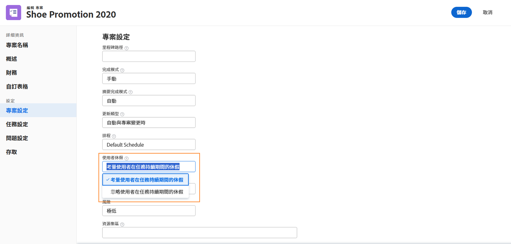
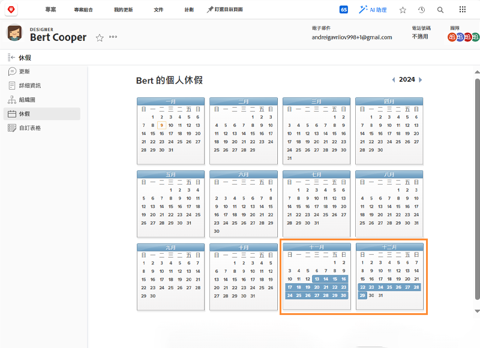
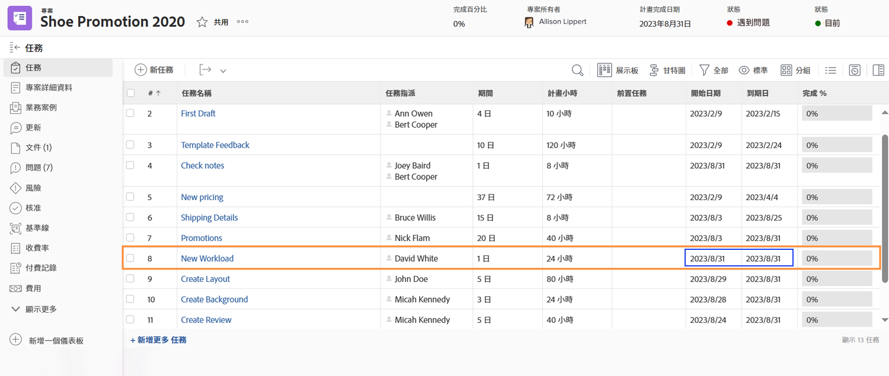
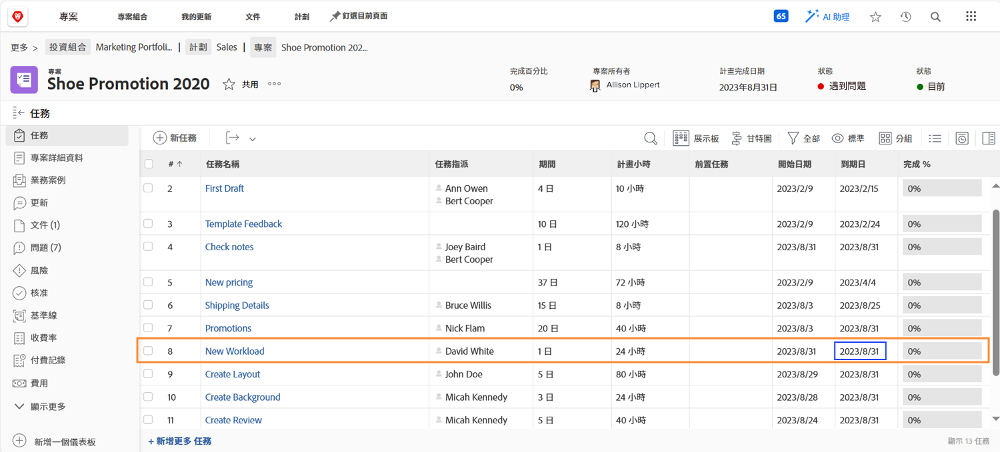
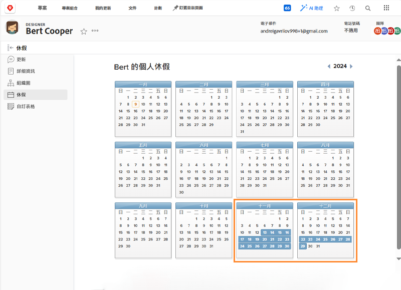
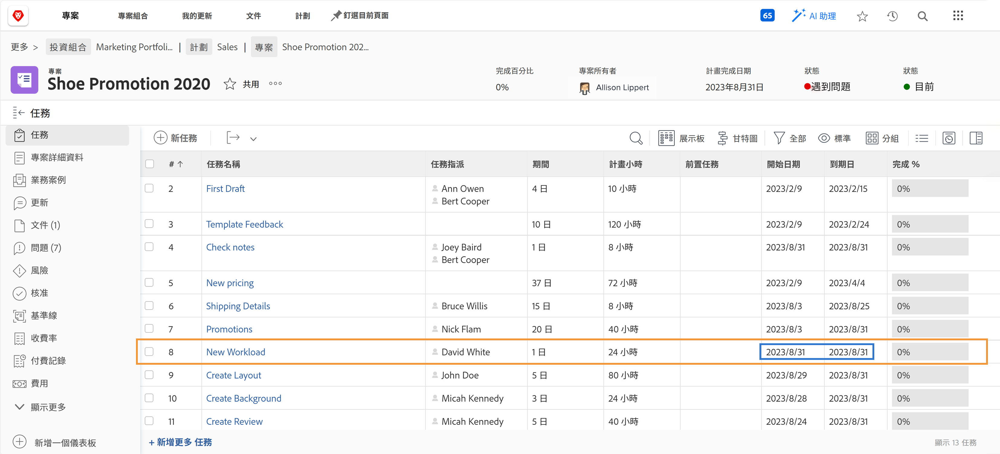
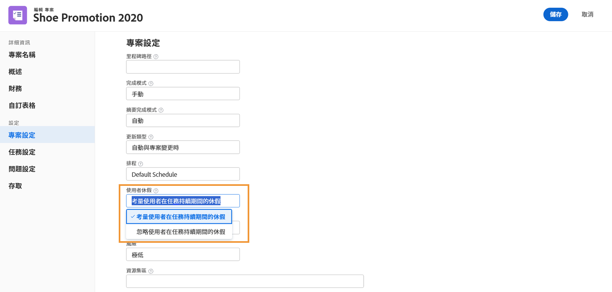

# 關閉時間如何影響項目時間表

指派的使用者在專案時間軸中的逗留時間因素，是否取決於專案設定，稱為 [!UICONTROL 用戶關閉時間]. 此設定確定任務的主要受託人的休息時間是否調整項目上該任務的計畫日期。

讓我們查看選取每個設定時專案時間軸會發生什麼事 — C[!UICONTROL 在任務持續時間內考慮用戶超時] 或 [!UICONTROL 忽略任務持續時間中的用戶超時].

## 考量使用者在任務持續期間的休假

此選項為Workfront的預設設定。

在此示例中，任務的主要受託人在其個人日曆上標籤了休假天數。

項目經理希望將此人員分配給具有與用戶休假時間重疊的計畫日期的任務。

將此用戶分配給任務後，計畫日期將自動調整。 現在，任務的計畫完成日期已延長了數天，以適應用戶的休假時間。 請務必注意，此更改可能會影響項目中其他任務的計畫日期，並可能影響項目的計畫完成日期。

## [!UICONTROL 忽略使用者在任務持續期間的休假]

使用此選項，即使主要受託人在該任務期間休假，任務的計畫日期仍按原計畫。

團隊成員的日曆上有天假。

項目經理為他們分配與休假時間重疊的任務。 分配用戶後，任務計畫日期將保持原計畫狀態。

為確保按時完成工作，在原受讓人不在辦公室時，分配可以處理該任務的其他人員可能會有所幫助。

## 在專案層級調整設定

要更改項目上的「用戶關閉時間」設定，請執行以下操作：

* 在Workfront中按一下專案名稱，以開啟專案。

* 選擇 [!UICONTROL 編輯] 從頁首的3點功能表，位於專案名稱的右側。

* 捲動至 [!UICONTROL 專案設定] 區段，並尋找 [!UICONTROL 用戶關閉時間] 欄位。

* 選擇要應用到此項目的選項 —  [!UICONTROL 考慮任務持續時間中的用戶超時] 或我[!UICONTROL 在任務持續時間內查找用戶超時].

* 按一下 [!UICONTROL 儲存] 按鈕。

**附註**:當您選取 [!UICONTROL 專案詳細資料] 從「項目」頁的左面板菜單。

此項的全域設定存在於 [!UICONTROL 設定] 功能表。 此設定由您的系統管理員管理。 群組管理員可針對其管理的群組調整此設定。

Workfront建議您以您希望大部分專案處理組織休假的方式來設定此設定。

您也可以透過範本詳細資訊，將設定內建至專案範本。
