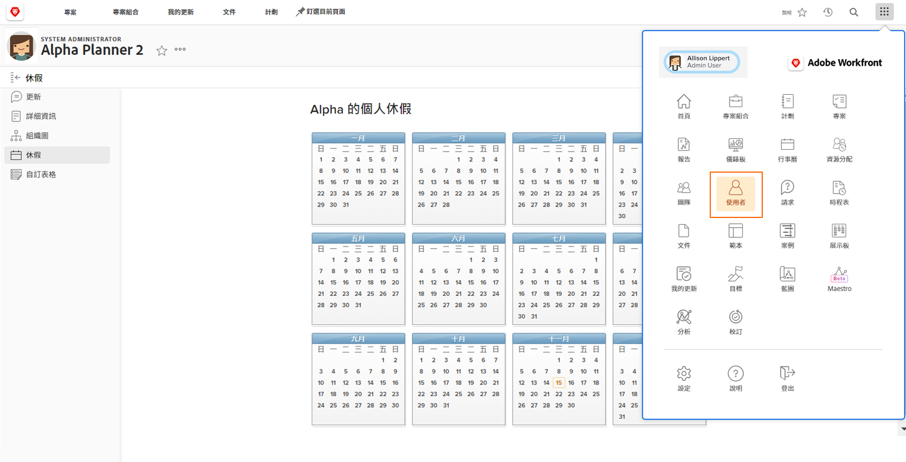

# 管理其他使用者的休假時間

如果經理或其他領導通過其Workfront訪問級別分配了「編輯用戶」權限，則他們可以管理其團隊成員的超時日曆。 存取層級是由Workfront系統管理員建立並指派。

Workfront建議貴組織制定管理員更新員工個人日曆時間的政策或程式。

要管理其他用戶的日曆：

* 按一下 [!UICONTROL 主菜單] 並選擇用戶。

* 使用搜索表徵圖查找用戶或滾動查看清單。

* 在清單中按一下使用者的名稱。

* 按一下 [!UICONTROL 關閉時間] ，位於使用者設定檔頁面的左側面板功能表中。

* 按一下日曆上的日期。

* Workfront假了一整天。 如果是，請繼續按一下 [!UICONTROL 儲存] 按鈕。

* 連續多天休假，將「截止」日期更改為離職的最後一天。 按一下 [!UICONTROL 儲存] 按鈕。

* 如果將部分日標籤為「關閉」，請取消選中 [!UICONTROL 全天] 框。 然後指出使用者當天的工作時間（可用的時間）。 按一下 [!UICONTROL 儲存] 按鈕。
