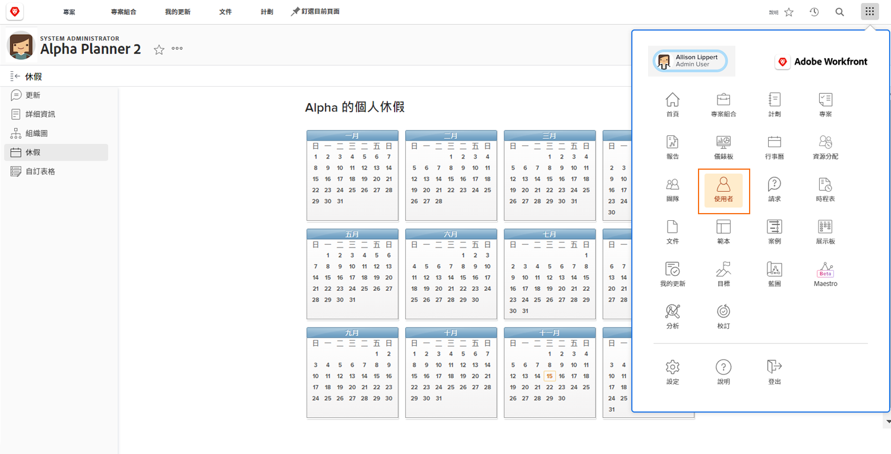

# 管理其他使用者的休假

如果管理員或其他主管透過其 Workfront 存取層級獲得編輯使用者的權限，則他們可以管理其團隊成員的休假行事曆。 存取層級由 Workfront 系統管理員建立和指派。

Workfront 建議貴組織針對管理員何時更新員工的個人休假行事曆制定相關政策或程序。

若要管理其他使用者的行事曆：

* 按一下[!UICONTROL 主選單]並選取「使用者」。

* 使用搜尋圖示來尋找使用者，或是捲動瀏覽清單。

* 按一下清單中的使用者名稱。

* 在使用者的設定檔頁面，在左側面板選單中按一下「[!UICONTROL 休假]」。

* 按一下行事曆上的日期。

* Workfront 假設是全天休假。 若是這種情況，請繼續並按一下「[!UICONTROL 儲存]」按鈕。

* 若是多日連續休假，變更「至」日期為不在辦公室的最後一天。 按一下「[!UICONTROL 儲存]」按鈕。

* 如果標記半天休假，請取消勾選「[!UICONTROL 全天]」方塊。 接著指明使用者在那一天的工作時數 (可從事工作的時數)。 按一下「[!UICONTROL 儲存]」按鈕。
