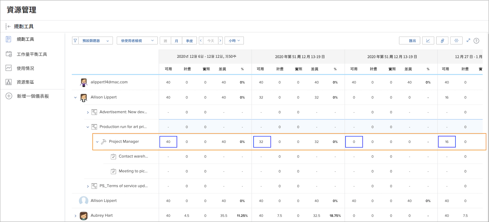
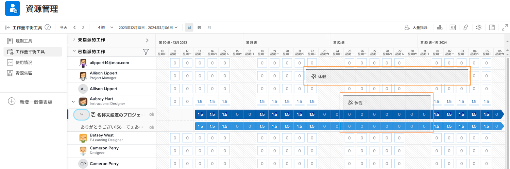

# 資源管理工具的可見度

瞭解誰在何時可以接受指派是資源規劃與管理的關鍵所在。當使用者在 Workfront 的行事曆中標記其個人休假，Workfront 的資源工具也可以看到該資訊。

## 資源規劃工具

使用者的休假會反映在資源規劃工具的「可用 (AVL)」欄。Workfront 把依據所指派的排程、職務角色百分比等計算得出的可用時間，減去人員在行事曆上標記的休假時間。

## 工作負載平衡器

在工作負載平衡器中，休假在行事曆上顯示為灰色橫軸。這樣的可見度協助資源管理員和其他人在指派工作時作出更明智的決策。

但是，工作負載平衡器並不會因為休假標示便停止指派工作給使用者。若有指派工作，工作負載平衡器顯示該名人員在休假期間配置的工作量過多。

