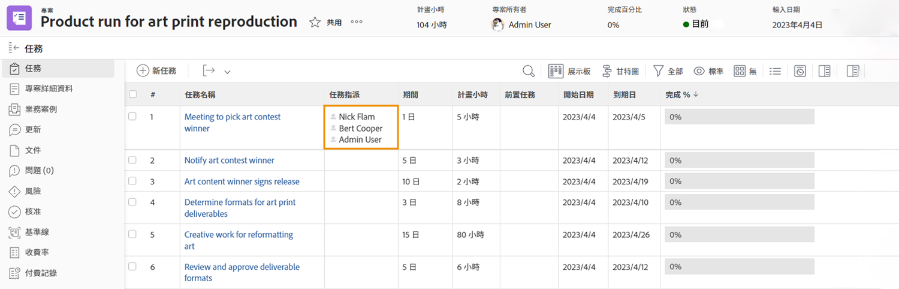
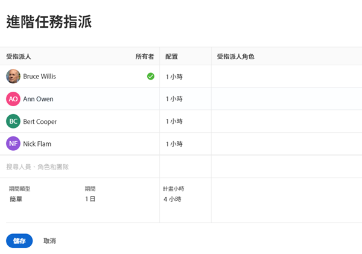
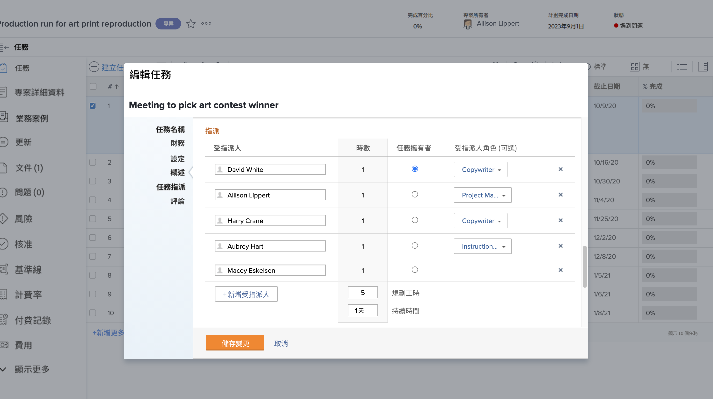

# 什麼是主要受指派者？

當兩位以上的使用者被指派執行一項任務時，便會出現主要受指派者。Workfront 在套用「使用者休假」設定時會查看主要受指派者的休假行事曆。

從專案頁面找出主要受指派者。按一下「指派」欄位，然後按一下角落的「進階指派」圖示。

在「進階指派」視窗中，用綠色的勾號指定主要受指派者或稱任務所有者。將游標懸停在另一位使用者上方，並按一下「設為主要」連結來變更任務所有者。

您還可以從任務頁面調整主要受指派者。勾選專案清單中任務的方塊，然後按一下「編輯」圖示。捲動到「指派」區段，然後按一下按鈕來指定任務所有者。

