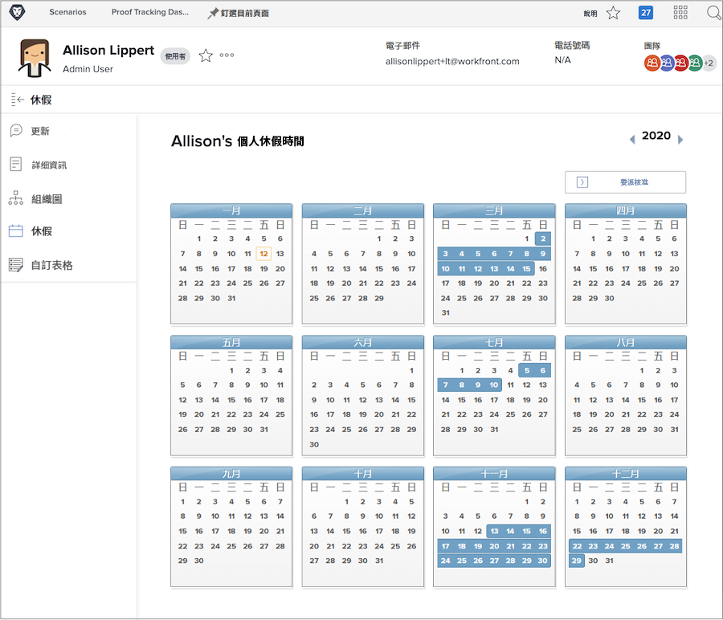
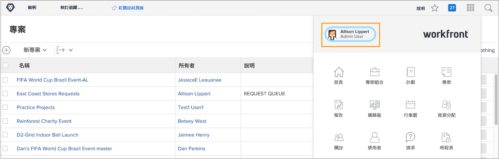
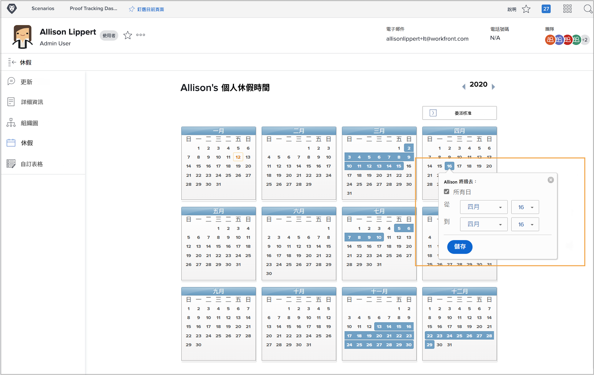

# 為何使用休假行事曆？

當規劃者和專案經理人在 Workfront 中指派任務時，瞭解哪些團隊成員有時間可以完成所指派的工作以利專案能夠準時完成。

當資源管理員在 Workfront 的資源規劃和管理工具中檢閱配置內容時，可用人力的準確資料也會影響目前和未來的工作規劃。

Workfront「工作」和「計劃」授權的使用者可以使用個人休假行事曆來表示他們在一般工作時間中無法承接工作的時間。即使是休假半天，也會影響是否能完成所指派任務。

**備註**：Workfront 的設計並不是為了複製或取代貴組織用於管理、累積或追蹤個人休假時間的現有系統。請遵循貴組織的休假請求與管理準則。

## 標記您的休假

您的個人休假行事曆位於您在 Workfront 的使用者頁面上，可透過主選單存取。在左邊角落按一下您的名稱。

* 在 Workfront 中，在您的使用者頁面的左側面板選單中按一下「休假」。

* 依預設顯示目前年份。如有必要，請使用箭頭來選取不同的年份 (位於行事曆視窗的右上角)。

* 按一下行事曆上的日期。

* Workfront 假設您要全天休假。若是這種情況，請繼續並按一下「儲存」按鈕。

* 如果您連續多天全天休假，請將「至」的日期變更為您不在辦公室的最後一天。按一下「儲存」按鈕。

* 如果您不是全天休假，請取消勾選「全天」方塊。然後指出您那一天的工作時間 (您有空的時間)。按一下「儲存」按鈕。

您的休假在行事曆上以藍色方塊表示。這個休假資訊也會出現在 Workfront 的其他地方，以協助專案和資源規劃。

**專家提示**：如果任務已指派給您，然後您在行事曆上標記休假，專案經理人不會收到任何通知，告訴他們您那段時間無法承接工作。任何新的休假如果可能影響目前專案或您被指派的工作，請務必向專案經理人更新資訊。
