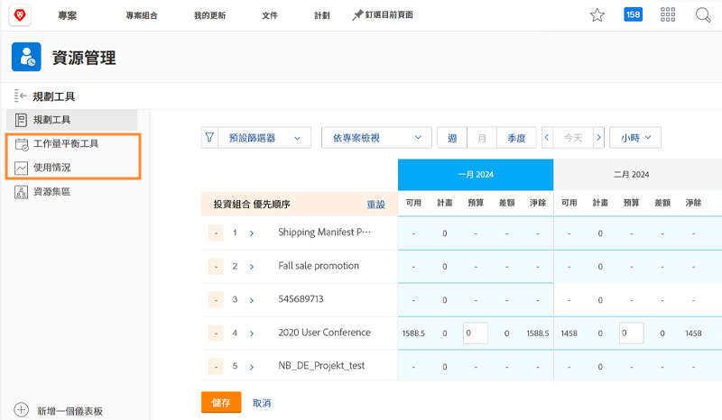

# 資源管理設定、工作負載平衡器與使用情況報告

[!DNL Workfront] 提供資料，而且 [!DNL Workfront] 中多種工具均可使用，協助您更輕鬆做出資源決策，並使流程執行更順利。 要瞭解資源的使用情況，您應該確保您的管理員、使用者和專案均設定正確。 即使您不打算使用 [!DNL Workfront's] 全部的資源管理工具，這些設定仍十分實用。

在本節中，您將瞭解

* 如何設定資源管理工具並授予適當的存取權
* 如何檢視工作負載平衡器與使用情況報告

## 資源管理設定

首先，要確認僅有適當的人員能夠存取及管理貴組織的資源。

&lt;！下載指南以取得逐步指示。&gt;

## 工作負載平衡器和使用情況報告

除了資源規劃工具和資源集區以外，使用者若擁有存取層級的編輯權限，亦可存取其他工具，例如工作負載平衡器和使用情況報告。

透過這些工具存取或管理資源並不需要進行其他設定。

