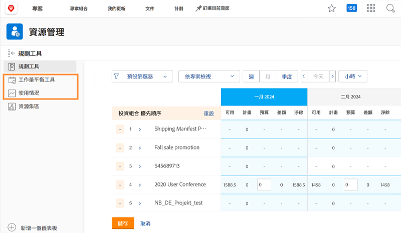

# 資源管理設定、工作負載平衡器和利用率報告

[!DNL Workfront] 選件資料，可跨 [!DNL Workfront]，協助您更輕鬆進行資源決策，並讓流程更順暢。 若要查看資源的運作情況，您應確定管理員、使用者和專案皆已正確設定。 即使您不打算使用全部的 [!DNL Workfront’s] 資源管理工具。

在本節中，您將學習：

* 如何設定具有正確訪問權限的資源管理器
* 如何查看工作負載平衡器和利用率報告

## 資源管理設定

首先，請確定適當的人員有權存取並可管理您組織的資源。

&lt;!Download the guide for step-by-step instructions.&gt;

## 工作負載平衡器和利用率報告

與資源規劃器和資源池一樣，當在訪問級別中授予「編輯」權限時，用戶可以訪問其他工具，如工作負載平衡器和利用率報告。

無需其他設定即可透過這些工具存取或管理資源。

