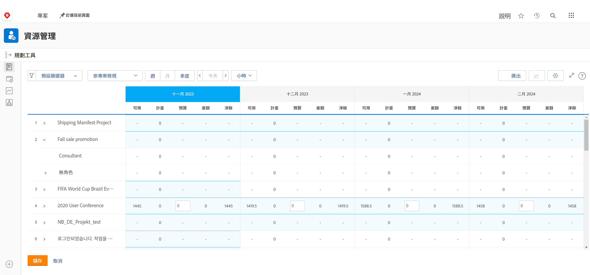

# 按作業角色查看 [!DNL Resource Planner]

在此影片中，您會：

* 請參閱 [!UICONTROL 按作業角色查看 ]檢視
* 了解資源資訊在此檢視中的顯示方式

>[!VIDEO](https://video.tv.adobe.com/v/335169/?quality=12&learn=on)

對於「按作業角色查看」選項，預設值是顯示「已預算」列，該列可從業務案例中提取項目所需的估計資源數（如果已填寫）。 這也表示依預設，Net欄會使用「預算」欄的數字來告訴您還剩多少資源。

不過，您的組織可能未使用或準備使用業務案例來估計這些金額。 而是使用已在專案中輸入的計畫小時數。 通過「自定義」選項，您可以選擇在所選視圖中顯示哪些列以及希望如何計算Net列。

要更改顯示的列和Net列計算，以便根據計畫小時數：

* 按一下「小時」下拉式功能表，然後選取「自訂」。

* 在「自定義顯示的度量」框中，確定顯示的列，並選中在NET計算中使用計畫值(PLN)旁邊的框。

**附註**:通過在框的左側選擇一個選項，您可以編輯資源規劃器中不同視圖類型的列和計算。

* 按一下「儲存」後，方塊會關閉，畫面會重新整理。

資源規劃器顯示您需要了解的有關供應和需求的資訊，而不需要複雜的電子錶格和循環通信。

利用手頭的資訊和您所指揮的工具，您可以微調您的團隊執行對您而言重要工作的能力。
