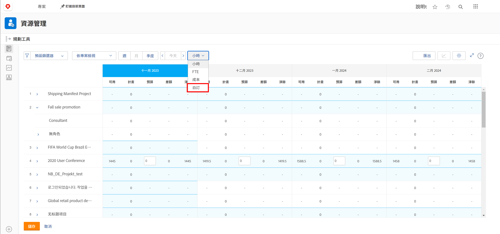
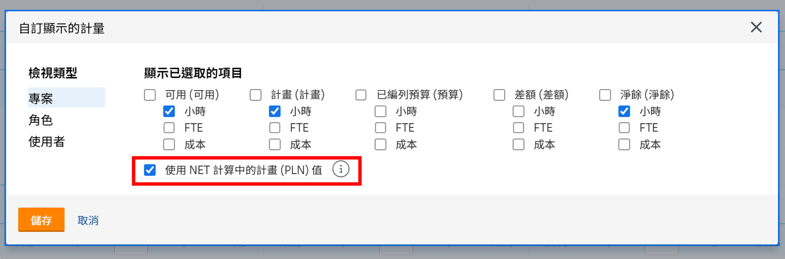
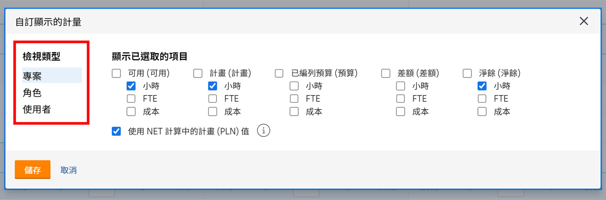
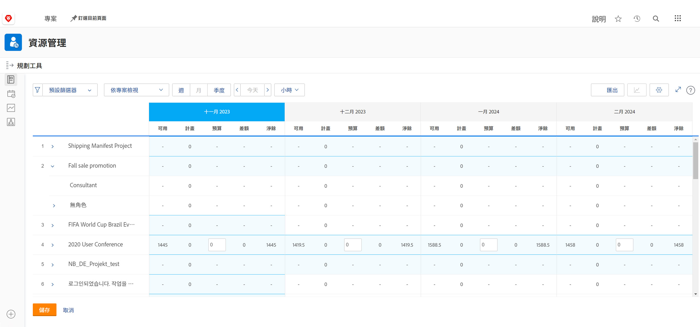

# 在[!DNL Resource Planner]中依專案檢視

觀看這段影片，您將：

* 查看「[!UICONTROL 依專案檢視]」視圖
* 瞭解資源資訊在此視圖中如何顯示

>[!VIDEO](https://video.tv.adobe.com/v/3431632/?quality=12&learn=on&enablevpops=1&captions=chi_hant)

「依專案檢視」選項是預設顯示「已編預算」欄，它會從業務案例提取專案所需資源的預估數量，若已填入這項資訊的話。這也表示「淨值」欄依預設使用「已編預算」欄的數字，讓您知道尚有多少剩餘資源。

但是，您的組織可能並未使用或未準備好使用業務案例來估算這些金額。作為替代，您可以使用專案中已輸入的規劃時數。透過「自訂」選項，您可以選擇哪一欄出現在所選視圖中，以及您要如何計算「淨值」欄。

若要變更所出現的欄以及「淨值」欄的計算方式，使其以規劃時數為準：

* 按一下「時數」下拉式選單並選取「自訂」。

* 在「自訂顯示指標」方塊中，決定要顯示哪一欄，並勾選「使用規劃 (PLN) 值進行 NET 計算」旁邊的方塊。

**備註**：您可以在資源規劃工具中選取方塊左側的選項，編輯不同類型視圖的欄和計算。

* 按一下「儲存」後，方塊便會關閉，而畫面重新整理。

資源規劃工具顯示您所需要知道的供需資訊，不需要複雜的試算表和多次往返通訊。

藉由手上擁有的資訊以及由您控制的工具，您可以調整團隊的產能來執行您認為重要的工作。
