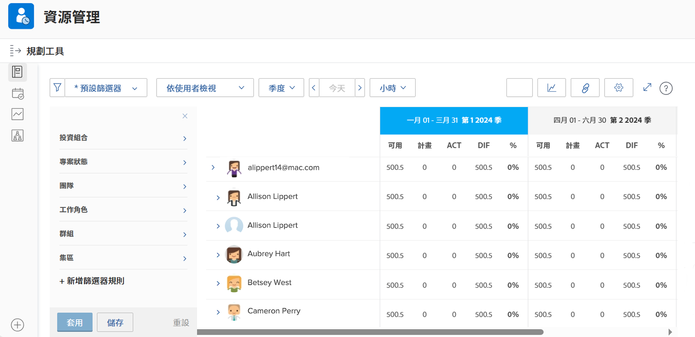

# 檢視使用情況與篩選資源規劃工具

藉由資源規劃工具，您可以清楚瞭解感興趣的專案，並即時瞭解您的人力如何執行這些專案。

* 例如，當最新的伺服器更新行動方案成為您的首要任務時，您想知道產能會發生什麼變化。

* 資源規劃工具顯示您的人員可用性，以及將資源配置給一個專案時會如何影響優先順序較低的專案所能使用的資源。

您不僅能夠看到資源配置如何影響今天的工作，而且當您把眼光放在即時資源排程需求之外，便能評估長期的資源配置來瞭解個別員工是否工作量過多 (或過少)。

## 篩選資源規劃工具

資源規劃工具會使用預設篩選器自動開啟。您想要編輯這些篩選器的以下設定：

* 時間段
* 專案組合/方案
* 資源集區等

這樣您便可以專心瞭解哪些資源可用以及何時可用。
