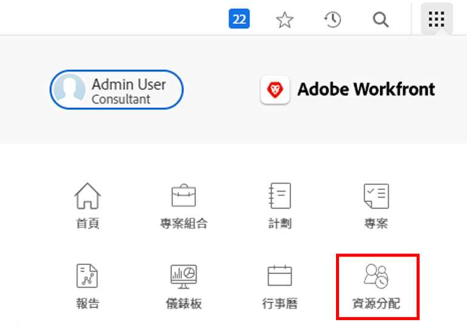
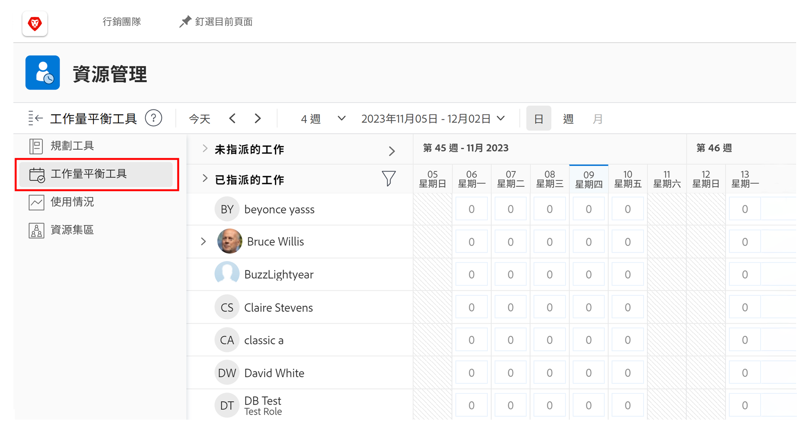
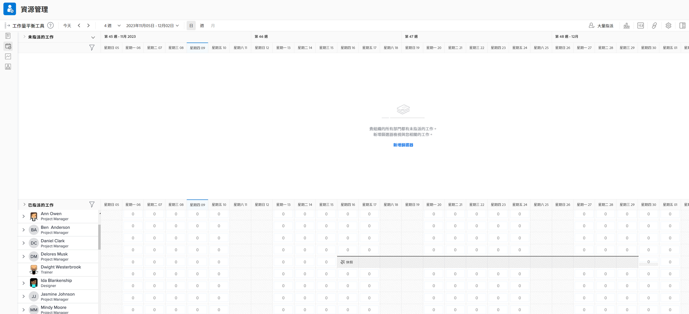

# 尋找 [!DNL Workload Balancer]

了解哪些資源可用以及如何分配這些資源對於任何人來說都是一項挑戰。 這就是為什麼Workfront [!DNL Workload Balancer].

其目的是讓您更深入了解和管理您所管理人員的日常和每週工作負載。 這可協助您根據角色和可用性，在多個專案間進行更佳的指派。

* 按一下 [!UICONTROL 資源] 在 [!UICONTROL 主菜單].
* 前往 [!UICONTROL 工作負載平衡器] 節。

## 工作負載平衡器中的區域

兩個區段會出現在 [!DNL Workload Balancer]:已分配工作和未分配的工作。

「已指派的工作」區域會顯示使用者清單，以及他們已在Workfront中指派的工作。 依預設，系統會將此區域篩選為您所屬Workfront團隊的一部分使用者。 這樣，您就可以查看已指派哪些團隊成員進行工作。

「未分配的工作」區域顯示仍需要分配的工作，無論是人員、職務職責還是團隊。 不過，一開始，此區域不會顯示任何內容。

從「未分配的工作」區域開始為空，您便有機會在進行分配之前，先在「已分配的工作」區域中關注用戶的當前工作負載。
