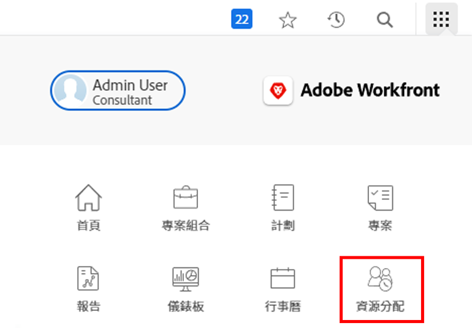
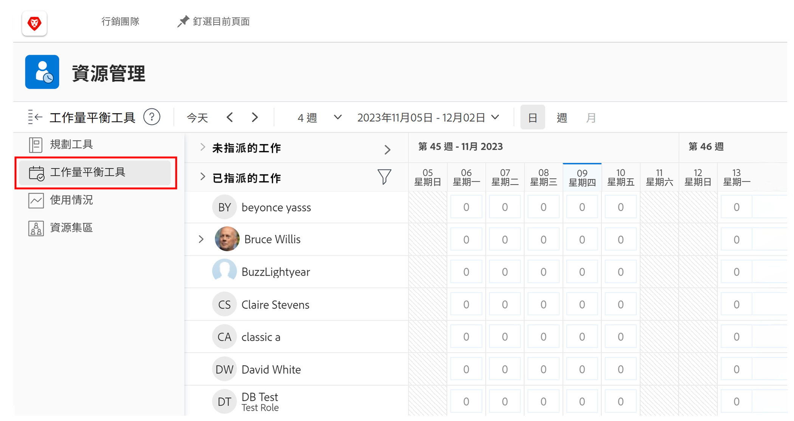
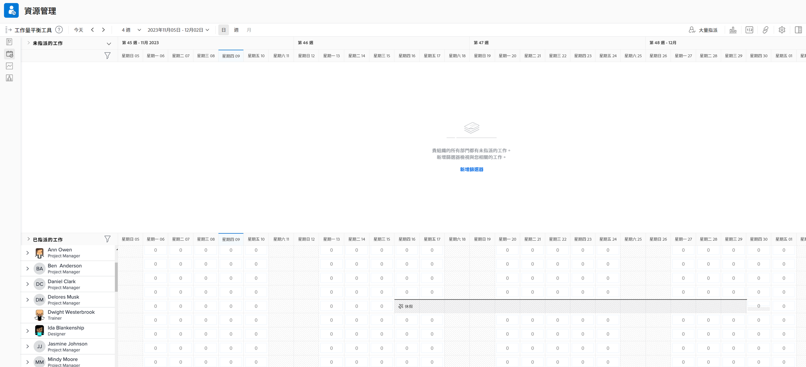
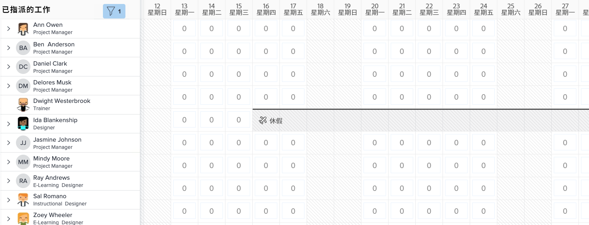

# 找出[!DNL Workload Balancer]

知道有哪些資源可用以及如何分配這些資源，對任何人而言都是具有挑戰性的任務。 所以 Workfront 建立了[!DNL Workload Balancer]。

其用途是讓您對於所管理的人員每日和每週的工作負載有更深入的洞察並進行相關管理。 這項工具可協助您根據角色和可工作的時間，針對多個專案進行更適當的指派。

* 在[!UICONTROL 主選單]中按一下「[!UICONTROL 資源配置]」。
* 前往「資源管理」區域中的「[!UICONTROL 排程]」區段。
* 按一下出現的「[!UICONTROL 工作負載平衡器]」區段。

## 工作負載平衡器內的區域

[!DNL Workload Balancer]中出現兩個區段：「已指派工作」和「未指派工作」。

「已指派工作」區域顯示使用者清單以及他們在 Workfront 中被指派的工作。 依預設，這個區域會篩選為屬於您的 Workfront 團隊的使用者。 這樣您便可以看到團隊成員的工作指派情形。

「未指派工作」區域顯示等待指派的工作，無論要指派給人員、職務角色或團隊。 不過，一開始的時候這個區域不會顯示任何內容。

「未指派工作」區域一開始留白，您便會機會在進行指派之前，先著眼於「已指派工作」區域中您的使用者目前的工作負載。
