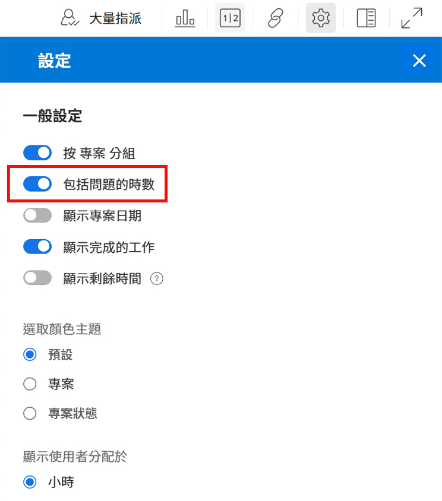
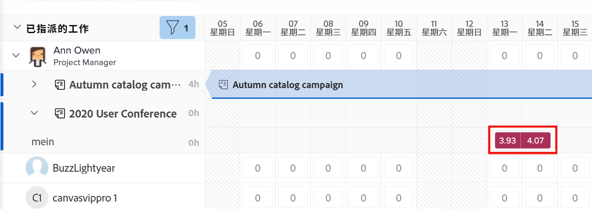
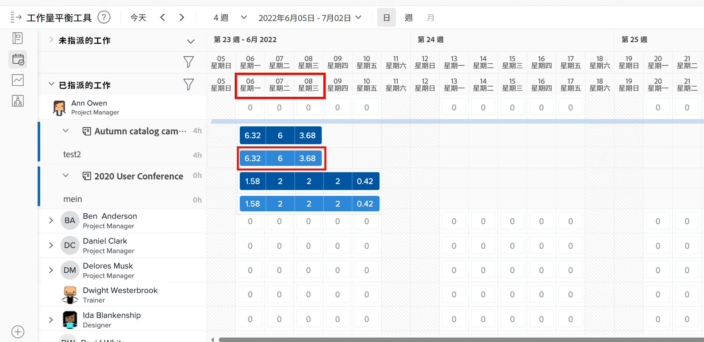
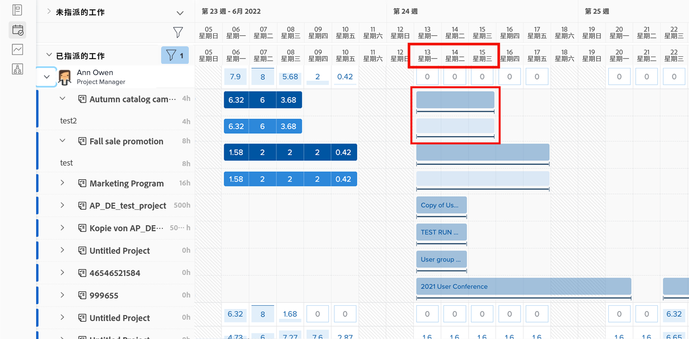
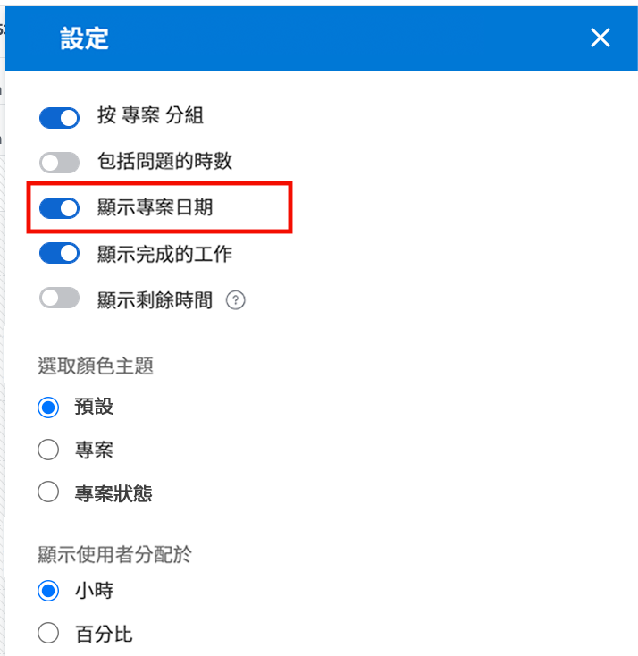
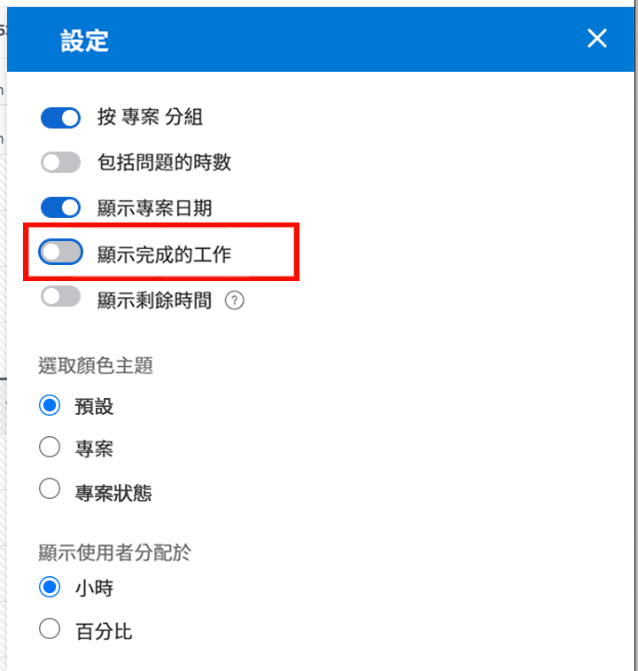

# 工作負載平衡器要考慮的設定

當您深入瞭解您的使用者個別的工作負載時，需要考慮幾個工作負載平衡器設定：

* 問題指派
* 預計日期
* 已完成的工作

這些設定均可透過「工作負載平衡器設定」圖示開啟或關閉。

## 包括問題的時數

依預設，工作負載平衡器僅顯示任務。然而，使用者可能會被指派要處理需要滿足或解決的請求和問題，這會佔用他們在專案工作上花費的時間。

要詳細瞭解使用者全部的工作負載，Workfront 建議把問題包含在使用者指派工作清單中。

只需勾選工作負載平衡器「設定」區域中的「包括問題的時數」選項。

在「已指派的工作」區域中，問題以褐紅色橫軸顯示。

### 專案日期

工作負載平衡器設定提供的另一個選項是根據預計日期顯示工作負載。

預設設定顯示根據專案中輸入的規劃日期顯示所指派的工作。

由於預計日期以專案中先前任務的進度和完成情況為準，因此您可以「即時」看到任務即將開始或結束的時間，在檢閱工作負載時，這個功能特別實用。

您可以使用工作負載平衡器設定中「顯示預計日期」選項，切換使用規劃日期和預計日期來檢視。

### 已完成的任務

已完成的任務連同目前進行中或即將開始的任務一起顯示在工作負載平衡器中。若要詳細瞭解使用者還可以處理哪些其他工作，您可能想要排除已完成的工作。

在工作負載平衡器設定中取消勾選「顯示完成的工作」選項。

